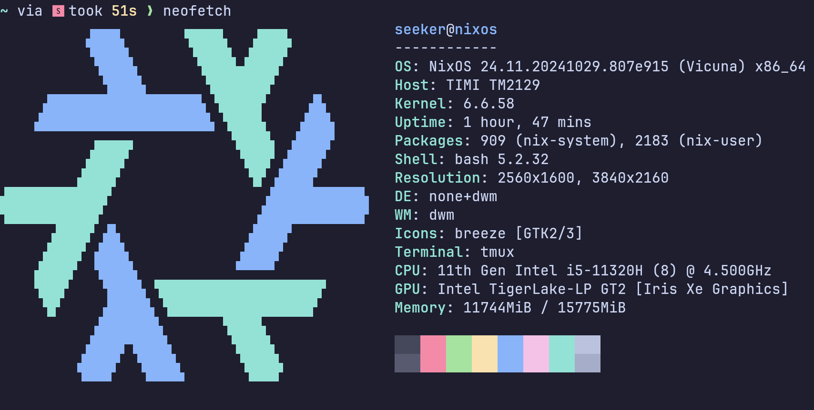
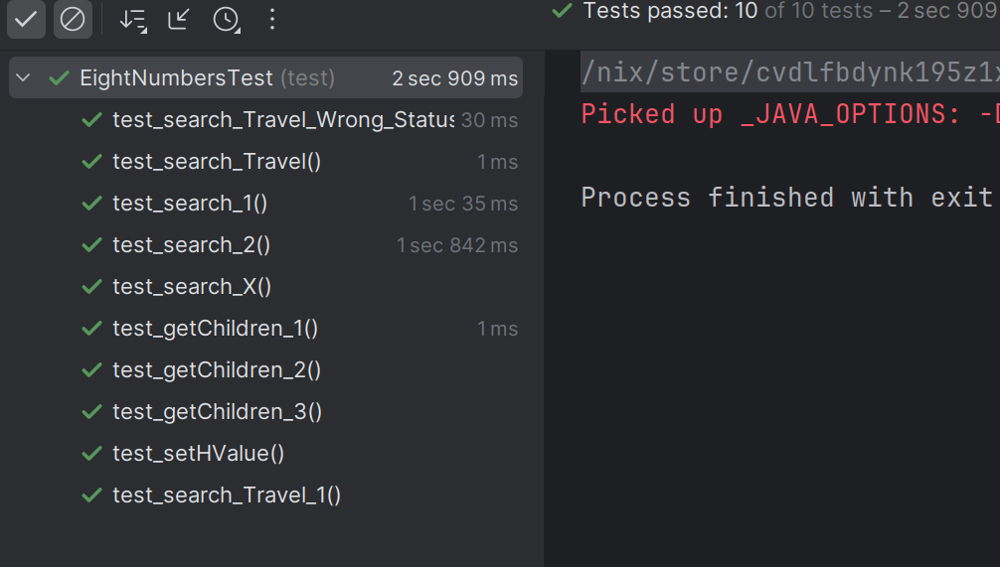

# 人工智能试验报告-Lab1-Search

---
学号: 2022211100 班级:2220701 姓名:郭明轩

---

## 实验目的

- 掌握搜索的基本算法
- 掌握A*搜索算法，理解估价函数中成本函数与启发函数的作用

## 实验环境

- openjdk-17
- IDEA



## 关键代码

### AStar

```java
public class AStar extends SearchAlgorithm {
	public AStar() {
		MaxSteps = 362880;
	}


	@Override
	public void updateTree(Status child) {	
		// done
		// use sameAs to compare whether the same
		// if already in unextended Table - record the better way
		// if already in extended Table - update to best way
		// the description on the textbook is a dum shit, check these for a better approach
		// https://www.geeksforgeeks.org/a-search-algorithm/
		// https://en.wikipedia.org/wiki/A*_search_algorithm/

		for (Status s : extendedStatuses) {
			if(s.sameAs(child)){
				if(child.betterThan(s)){
					//child is better than s,add  the node to the open list
					unextendedStatuses.add(child);
				}else{
					//s is better than child,skip this child
				}
				return;
			}
		}
		for (Status s : unextendedStatuses) {
			if(s.sameAs(child)){
				if(child.betterThan(s)){
					unextendedStatuses.remove(s);
					unextendedStatuses.add(child);
				}
				return;
			}
		}
		unextendedStatuses.add(child);
	}
}
```

### SearchAlgorithm/Search

```java
	public void search() {
		if(unextendedStatuses==null&&currentStatus==null){
			this.searchResult=No_Status_To_Extend;
			return;
		}
		//if null,get one
		if(currentStatus==null){
			currentStatus=unextendedStatuses.get(0);
			unextendedStatuses.remove(0);
		}
		// done
		while(true) {
			//in this Loop:get children then undate tree?
			if(steps>MaxSteps){
				//Failed to fetch an Answer while Exceed MaxSteps
				this.searchResult=No_More_Step;
				return;
			}
			steps++;
			List<Status> childs=currentStatus.getChildren();
			for(Status child:childs) {
				updateTree(child);
			}
			//Why not Employ PriorityQueue?
			unextendedStatuses.sort(new Comparator<Status>() {
				public int compare(Status s1, Status s2) {
					return s1.betterThan(s2) ? -1:1;
				}
			});
			extendedStatuses.add(currentStatus);
			if(unextendedStatuses.isEmpty()&&!currentStatus.isTargetStatus()) {
				//No status to extend , problem unsolvable
				this.searchResult=No_Status_To_Extend;
				return;
			}
			//get next status
			currentStatus=unextendedStatuses.getFirst();
			if(currentStatus.isTargetStatus()) {
				//Reach The target Status,Exiting
				this.searchResult=Succeed;
				break;
			}
			//remove from unexpected
			unextendedStatuses.remove(currentStatus);
		}

	}
```


### EightNumbers/getChildren

```java
	@Override
	public List<Status> getChildren() {
		List<Status> ls = new ArrayList<Status>();
		// done
		// have 2/3/4 children,then set Parent
		for (int i = 0; i < 4; i++) {
			EightNumbers st = new EightNumbers();
			int[][] status = deepClone(currentStatus);
			switch (i) {
				case 0:
					if(swapStatus(status, spaceAt[0] + 1, spaceAt[1]))
						continue;
					break;
				case 1:
					if(swapStatus(status, spaceAt[0] - 1, spaceAt[1]))
						continue;
					break;
				case 2:
					if(swapStatus(status, spaceAt[0], spaceAt[1] + 1))
						continue;
					break;
				case 3:
					if(swapStatus(status, spaceAt[0], spaceAt[1] - 1))
						continue;
					break;
			}
			st.setStatus(status);
			st.parent = this;
			st.setHValue();
			st.g=this.g+1;
			ls.add(st);
		}
		return ls;
	}
```

### EightNumbers/setHValue

```java
	public void setHValue() {
		// done
		h = 0;
		for (int i = 0; i < 3; i++) {
			for (int j = 0; j < 3; j++) {
				if (currentStatus[i][j] != targetStatus[i][j]) h++;
			}
		}
	}
```


### updateTree

```java
public class DepthFirst extends SearchAlgorithm {
	public DepthFirst() {
		MaxSteps = 362880;
	}

	@Override
	public void updateTree(Status child) {	
		int r = findStatus(child, unextendedStatuses);
		if (r >= 0) {
			unextendedStatuses.remove(r);						
		}
		unextendedStatuses.add(0, child);
	}

}


```

### Travel/getChildren

```java
	//Helper Function to deep clone int[] Objects
	private int[] deepClone(int[] source) {
		int[] copy = new int[source.length];
		for (int i = 0; i < source.length; i++) {
				copy[i] = source[i];
		}
		return copy;
	}
	public void setStatus(int[] nums) {
		currentStatus = nums;
		setHValue();
	}
	@Override
	public List<Status> getChildren() {
		List<Status> r = new ArrayList<Status>();
		// done
		for (int i = 0; i < 4; i++) {
			Travel st = new Travel();
			int[] status = deepClone(currentStatus);
			switch (i) {
				case 0:
					status[0] -= 1;
					if (isForbidden(status))
						continue;
					break;
				case 1:
					status[0] += 1;
					if (isForbidden(status))
						continue;
					break;
				case 2:
					status[1] += 1;
					if (isForbidden(status))
						continue;
					break;
				case 3:
					status[1] -= 1;
					if (isForbidden(status))
						continue;
					break;
			}
			st.setStatus(status);
			st.parent = this;
			st.setHValue();
			st.g=this.g+1;
			r.add(st);
		}
		return r;
	}

```


### Travel/setHValue

```java
	private void setHValue() {
		// done
		//simply return the distance
		h=Math.abs(currentStatus[1]-targetStatus[1])+Math.abs(currentStatus[0]-targetStatus[0]);
	}
```


## 测试结果



## 实验总结

通过本次实验，我成功掌握了搜索算法的基本原理，特别是A*搜索算法，该算法结合了成本函数和启发函数，使得搜索过程更加高效。实验在OpenJDK 17环境下进行，使用IDEA作为开发工具，代码结构清晰，注释详细，便于理解和修改。关键代码实现了A*搜索的核心逻辑，通过优先队列管理未扩展节点，确保每次扩展的都是当前最优节点。测试结果显示，A*算法在处理八数码问题时表现出色，能够在合理的时间内找到最优解，验证了算法的有效性。本次实验不仅让我深入理解了A*搜索算法的原理和实现，还提升了我的编程能力和问题解决能力，为我今后的学习和研究打下了坚实的基础。
