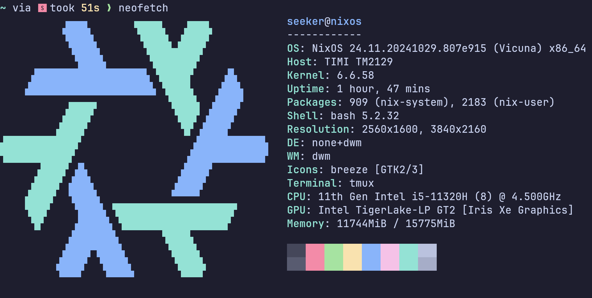

# 人工智能试验报告-Lab2

---
学号: 2022211100 班级:2220701 姓名:郭明轩

---

## 实验目的

- 掌握归结推理的算法
- 熟悉自动化测试技术

## 实验环境

- openjdk-17
- IDEA



## 关键代码

### prase状态机

这个状态机写的非常抽象，花了很长时间才理解

```java

    public static Formula parse(String s) throws ParseException {
    	Formula f = null;
    	
    	Stack<Character> ops = new Stack<Character>();
    	Stack<Formula> fs = new Stack<Formula>();
    	Stack<Quantifier> qs = new Stack<Quantifier>();
    	//The FUCKING State Machine didn't even have a comment!!!!
		/*
		* The Following is just my guess
		* ０-Initial Status
		* １- Space And OP_NOT
		* 	    - If Left Bracket goto 2
		* 		- If Predicate ,goto 9
		*
		* 2 - Char after left bracket
		* 		- If Predicate ,goto 9
		* 		- If OP_NOT ,goto 1
		* 		- If Q_FULL/Q_EXISTENTIAL ,goto 11
		*
		* 9  - Char after Predicate
		* 10 - Space and Right Bracket
		* 		- If BinaryOp --------------- goto 1
		* 11 - After Quantification (Universal or Existential)
		* 		- if hit variable ，goto,12
		* 12 - Deals With variable Name Lager than 2
		* 13 - Str After variable
		*
		* */
    	int status = 0;
    	char c;
    	int i = 0;
    	Quantifier q = null;
    	StringBuffer name = null;
    	Term v = null;
    	while (!endOfString(s, i)) {       // 结束条件
    		c = s.charAt(i);
    		switch (status) {
    		case 0, 1:
    			if (c == C_SPACE) {
    				status = 1;
    			} else if (c == OP_NOT) {
    				status = 1;
    				ops.push(c);
    			} else if (c == L_BRACKET) {
    				status = 2;
    				ops.push(c);
    			} else if (startsAName(c)) { // 原子谓词的开头    				
    				Object[] tmp = AtomicFormula.parse(s, i); //解析原子谓词，返回一个原子谓词，和原子谓词结束的字符序号
    				fs.push((Formula) tmp[0]);
    				i = (Integer)tmp[1];
    				status = 9;
    			} else {
    				throw new UnexpectedCharacterException(s, i, status);
    			}
    			break;
    		case 2:
    			if (c == C_SPACE) {
    				status = 2;
    			} else if (c == OP_NOT) {
    				ops.push(c);
    				status = 1;
    			} else if (c == L_BRACKET) {
    				ops.push(c);
    				status = 2;
    			} else if (startsAName(c)) { // 同status == 0
    				Object[] tmp = AtomicFormula.parse(s, i);
    				fs.push((Formula) tmp[0]);
    				i = (Integer)tmp[1];
    				status = 9;
    			} else if (c == Q_FULL) {
    				q = new FullQuantifier();
    				ops.pop();
    				status = 11;
    			} else if (c == Q_EXISTENTIAL) {
    				q = new ExistentialQuantifier();
    				ops.pop();
    				status = 11;
    			} else {
    				throw new UnexpectedCharacterException(s, i, status);
    			}
    			break;
    		case 9, 10:
    			if (c == C_SPACE) {
    				status = 10;
    			} else if (c == R_BRACKET) {     // 中序转后序，弹出至相应左括号
    				if (!popToLeftBracket(ops, fs, qs)) throw new UnmatchedRightBracketException(s, i, status);
    				status = 10;
    			} else if (isBinaryOperator(c)) {    				
    				popUntilPush(ops, fs, qs, c);   // 中序转后序，弹出至出现优先级更高或相同的连接符
    				status = 1;    				
    			} else {
    				throw new UnexpectedCharacterException(s, i, status);
    			}
    			break;
    		case 11:
    			if (c == C_SPACE) {
    				status = 11;
    			} else if (startsAName(c)) {
    		    	name = new StringBuffer();
    				name.append(c);
    				status = 12;
    			} else {
    				throw new UnexpectedCharacterException(s, i, status);
    			}
    			break;
    		case 12:
    			if (c == C_SPACE) {
    				v = new Term();
    				v.setName(name.toString());
					status = 13;
				} else if (c == R_BRACKET) {
    				v = new Term();
    				v.setName(name.toString());
    				q.setVariable(v);
    				qs.push(q);
    				ops.push(Q_LABEL);
    				status = 1;
    			} else if (insideAName(c)) {
    				name.append(c);
    				status = 12;
    			} else {
    				throw new UnexpectedCharacterException(s, i, status);
    			}
    			break;
    		case 13:
    			if (c == C_SPACE) {
					status = 13;
				} else if (c == R_BRACKET) {
    				q.setVariable(v);
    				qs.push(q);
    				ops.push(Q_LABEL);
    				status = 1;
    			} else {
    				throw new UnexpectedCharacterException(s, i, status);
    			}
    			break;
    		default:
    			break;
    		}
    		
    		i++;
    	}
    	
    	popAll(ops, fs, qs);
    	f = fs.pop();

    	return f;
    }

```


### resolve

```java
	//将当前子句和子句c进行归结，返回得到的归结式
	//如果两个子句不能归结，则返回null
	//如果返回空子句，则返回的子句的属性literals长度为0
	//NonLiteral---
	public Clause resolve(Clause c) {
		for (Literal l1 : this.getLiterals()) {
			for (Literal l2 : c.getLiterals()) {
				// if complementary
				if (l1.canResolve(l2)) {
					// Get the most general unifier
					Replacement mgu = Replacement.getMGU(l1, l2);
					if (mgu != null) {
						Clause result = new Clause();

						// Add literals from the current clause, excluding l1, and apply the replacement
//						result.getLiterals().addAll(mgu.replace(this.getLiterals()));

						for (Literal lit : this.getLiterals()) {
							if (!lit.equals(l1)) {
								Set<Literal>li=(new HashSet<Literal>());
								li.add(lit);
								result.getLiterals().add(mgu.replace(li).iterator().next());
							}
						}

						// l2
//						result.getLiterals().addAll(mgu.replace(c.getLiterals()));
						for (Literal lit : c.getLiterals()) {
							if (!lit.equals(l2)) {
								Set<Literal>li=(new HashSet<Literal>());
								li.add(lit);
								result.getLiterals().add(mgu.replace(li).iterator().next());
							}
						}

						// If the new clause is empty, return it
						if (result.getLiterals().isEmpty()) {
							return result;
						}

						return result;
					}
				}
			}
		}
		return null;  // Return Null if no resolution is possible
	}

```


### pushDownNot

```java
	// 谓词公式转换为子句集的第2步
	// 将二叉树中的逻辑非符号下移到叶节点，即原子公式前，返回处理后新的二叉树
	public static Formula pushDownNot(Formula f) {
		//Deploy Recursion may simplify the code
		Stack<Formula> stack = new Stack<>(); //Use stack to store the nodes to be processed
		stack.push(f); //root Node
		while(!stack.empty()){
			Formula tmp = stack.pop(); //the Node to be processed now
			if(tmp instanceof BinaryFormula) { // if tmp is a binary formula, process its children
				Formula left = ((BinaryFormula) tmp).getLeftChild();
				Formula right = ((BinaryFormula) tmp).getRightChild();
				if (right instanceof NonFormula nf) {//right child
                    if (nf.getChild() instanceof NonFormula) {//merge double noFormula
						((BinaryFormula) tmp).setRightChild(((NonFormula) nf.getChild()).getChild());
						stack.push(((NonFormula) nf.getChild()).getChild());
					}
					if (nf.getChild() instanceof ConjunctionFormula cf) {//push down the noFormula,pull up the quantifiers
                        DisjunctiveFormula df = new DisjunctiveFormula(new NonFormula(cf.getLeftChild()), new NonFormula(cf.getRightChild()));
						df.setQuantifiers(reverseQuantifier(cf.getQuantifiers()));
						((BinaryFormula) tmp).setRightChild(df);
						stack.push(df);
					}
					if (nf.getChild() instanceof DisjunctiveFormula df) {//push down the noFormula
                        ConjunctionFormula cf = new ConjunctionFormula(new NonFormula(df.getLeftChild()), new NonFormula(df.getRightChild()));
						cf.setQuantifiers(reverseQuantifier(df.getQuantifiers()));
						((BinaryFormula) tmp).setRightChild(cf);
						stack.push(cf);
					}
					if (nf.getChild() instanceof AtomicFormula af) {//
                        NonFormula nf1 = new NonFormula(af);
						nf1.setQuantifiers(reverseQuantifier(af.getQuantifiers()));
						af.setQuantifiers(null);
						((BinaryFormula) tmp).setRightChild(nf1);
					}
				}else{
					stack.push(right);
				}

				if (left instanceof NonFormula nf) {
                    if (nf.getChild() instanceof NonFormula) {
						((BinaryFormula) tmp).setLeftChild(((NonFormula) nf.getChild()).getChild());
						stack.push(((NonFormula) nf.getChild()).getChild());
					}
					if (nf.getChild() instanceof ConjunctionFormula cf) {
                        DisjunctiveFormula df = new DisjunctiveFormula(new NonFormula(cf.getLeftChild()), new NonFormula(cf.getRightChild()));
						df.setQuantifiers(reverseQuantifier(cf.getQuantifiers()));
						((BinaryFormula) tmp).setLeftChild(df);
						stack.push(df);
					}
					if (nf.getChild() instanceof DisjunctiveFormula df) {
                        ConjunctionFormula cf = new ConjunctionFormula(new NonFormula(df.getLeftChild()), new NonFormula(df.getRightChild()));
						cf.setQuantifiers(reverseQuantifier(df.getQuantifiers()));
						((BinaryFormula) tmp).setLeftChild(cf);
						stack.push(cf);
					}
					if (nf.getChild() instanceof AtomicFormula af) {
                        NonFormula nf1 = new NonFormula(af);
						nf1.setQuantifiers(reverseQuantifier(af.getQuantifiers()));
						af.setQuantifiers(null);
						((BinaryFormula) tmp).setLeftChild(nf1);
					}
				}else {
					stack.push(left);
				}

			}
			if(tmp instanceof NonFormula){
				NonFormula nf = (NonFormula) tmp;
				if(nf.getChild() instanceof NonFormula){
					((NonFormula) tmp).setChild(((NonFormula) nf.getChild()).getChild());
					stack.push(((NonFormula) nf.getChild()).getChild());
				}else if(nf.getChild() instanceof AtomicFormula){
					AtomicFormula af = (AtomicFormula) nf.getChild();
					tmp.setQuantifiers(af.getQuantifiers());
					af.setQuantifiers(null);
					((NonFormula) tmp).setChild(af);

				}
			}


		}
		return f;
	}
```

### putUpConjunction

```java

	// 谓词公式转换为子句集的第六步
	// 将二叉树转换为析取式的合取式，即将合取符上移，使合取符的祖先节点中没有析取符
	// 已处理非，蕴含，等价等符号，仅需处理析取节点子树中的合取符
	public static Formula putUpConjunction(Formula expr) {
		if(expr instanceof AtomicFormula){
			return expr;
		}
		if(expr instanceof NonFormula){
			//assume all ready
			((NonFormula) expr).setChild(putUpConjunction(((NonFormula) expr).getChild()));
			return expr;
		}
		if(expr instanceof BinaryFormula bf){
			if(bf instanceof ConjunctionFormula){
				bf.setLeftChild(putUpConjunction(bf.getLeftChild()));
				bf.setRightChild(putUpConjunction(bf.getRightChild()));
				return bf;
			}
			if(bf instanceof DisjunctiveFormula){
				Formula left = putUpConjunction(bf.getLeftChild());
				Formula right = putUpConjunction(bf.getRightChild());
				return distributeOr(new DisjunctiveFormula(left, right));
			}
			//Should not reach here
			throw new RuntimeException("Should not reach here");
		}
		throw new RuntimeException("Should not reach here");
	}

```

### combine

```java
	// 将置换{to/from}和当前置换复合，即this=this*{to/from}
	public void combine(Term from, Term to) {
		// Iterate over the current replacements, replacing all instances of 'from' with 'to'
		LinkedHashMap<Term, Term> newFromTo = new LinkedHashMap<>();
		for (Map.Entry<Term, Term> entry : fromTo.entrySet()) {
			Term key = entry.getKey();
			Term value = entry.getValue();

			// if contains 'from', replace it with 'to'
			if (value.equals(from)) {
				newFromTo.put(key, to);
			} else {
				newFromTo.put(key, value);
			}
		}

		// Add the 'from' -> 'to' mapping to the replacements
		newFromTo.put(from, to);

		// Update
		fromTo = newFromTo;
	}
```

### getReplacement

```java

	// 求将两个项合一的置换，如果两个项一致，返回空置换，如果两个项不能合一，返回null
	public static Replacement getReplacement(Term t1, Term t2) {
		Replacement r = null;

		// if euqals
		if (t1.equals(t2)) {
			return new Replacement();
		}

		// if variables
		if (t1.getType()==Term.T_VARIABLE) {
//			if (t2.getName().equals(t1.getName())) {
//				return new Replacement();
//			}
			r=(new Replacement());
			r.fromTo.put(t1, t2);
			return r;
		}

		// if variables
		if (t2.getType()==Term.T_VARIABLE) {
//			if (t1.getName().equals(t2.getName())) {
//				return new Replacement();
//			}
			r=(new Replacement());
			r.fromTo.put(t2, t1);
			return r;
		}

		// if func
		if (t1.getType()==Term.T_FUNCTION && t2.getType()==Term.T_FUNCTION) {
			r=new Replacement();
			if (!t1.getName().equals(t2.getName()) ||
					((Function)t1).getTerms().size() != ((Function)t2).getTerms().size()) {
				return null; // Name or terms size not equal
			}

			for (int i = 0; i < ((Function)t1).getTerms().size(); i++) {
				Replacement tmp = getReplacement(((Function)t1).getTerms().get(i), ((Function)t2).getTerms().get(i));
				if (tmp == null) {
					return null; // terms cannot be unified
				}
				tmp.combineTo(r);
//				r.combineTo(tmp);
			}
			return r;
		}

		// Otherwise
		return null;
	}

```

### reason

```java
	// 归结推理
	// 利用clauses属性中保存的子句集作为推理输入
	// 每一次推理循环中产生的归结式集合都保存在推理机的属性resolvedClauses中
	// 输出表示推理结果的字符串
	// 	如果求证成功，输出“Proved!"
	// 	如果是求解问题推理成功，输出”Found {n} answers: {%s }*n“，其中{n}表示答案的数量，{%s }*n表示n个答案，每个答案后面有一个空格
	// 	如果推理失败"Failed!"
	public String reason() {
		StringBuilder r = new StringBuilder();
		Set<Clause> currentClauses = new HashSet<>(clauses);
		Set<Clause> resolvedClauses = new HashSet<>();
		Set<Clause> answers = new HashSet<>();

		boolean find_new = false;
		do {
			find_new=false;
			for (Clause cl1 : currentClauses) {
				for (Clause cl2 : currentClauses) {
					if (!cl1.equals(cl2)) {
						Clause resolved = cl1.resolve(cl2);
						if (resolved == null) {
							continue;
						}
						if (resolved.getLiterals().isEmpty()) {
							r.setLength(0);
							r.append("Proved!");
							return r.toString();
						}
						if(!resolvedClauses.contains(resolved)) {
							find_new = true;
							resolvedClauses.add(resolved);
						}
					}
				}
			}
			currentClauses.addAll(resolvedClauses);
		}while(find_new);

		if(resolvedClauses.isEmpty()) {
			r.setLength(0);
			r.append("Failed!");
			return r.toString();
		}
		for(Clause cl: resolvedClauses) {
			if ((cl.getLiterals().size() == 1) && cl.getLiterals().iterator().next().isAnswer()){
					answers.add(cl);
			}
		}
		r = new StringBuilder("Found " + answers.size() + " answers: ");
		for(Clause cl: answers) {
			r.append(cl.getLiterals().iterator().next().toString());
			r.append(" ");
		}
		return r.toString();
	}

```

## TestResults


## 实验总结

通过本次实验，我们深入掌握了归结推理的算法，并熟悉了自动化测试技术。实验在 `openjdk-17` 和 `IDEA` 环境下进行，确保了代码的兼容性和开发效率。我们通过状态机解析逻辑公式，将输入的字符串转换为逻辑表达式，并实现了归结推理的核心逻辑，通过比较两个子句中的文字，找到互补的文字并进行归结。此外，我们还实现了将逻辑非符号下移到叶节点、将合取符上移、置换复合以及求将两个项合一的置换等关键功能。实验中的测试结果显示，代码在处理逻辑公式和进行归结推理时表现良好，通过自动化测试工具验证了代码的正确性和稳定性。总的来说，本次实验不仅加深了我们对归结推理算法的理解，还提高了我们的编程能力和问题解决能力，为今后的学习和研究打下了坚实的基础。
