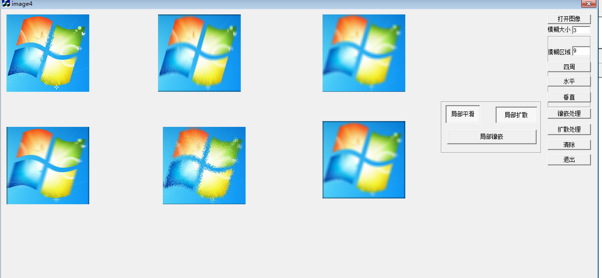

# 《数字图像处理》实验报告

## 实验五 彩色图像模糊处理

---
学号： 2022211100        姓名：郭明轩

---

### 实验目的

- 了解彩色图像与灰度图像空间滤波处理的区别。
- 掌握彩色图像的平滑、镶嵌和扩散处理方法。
- 熟悉VC++6.0鼠标交互方法。

### 实验内容

- 函数设计
    - 彩色图像的平滑处理函数：在函数中输出处理图像结果（下同）。
    - 彩色图像的镶嵌处理函数。
    - 彩色图像的扩散处理函数。
- 功能设计:在实验一的基础上完成以下功能：
    - 模糊处理范围大小和局部模糊范围通过编辑框输入。
    - 通过多个命令按钮分别实现平滑、镶嵌和扩散处理。
    - 不同处理结果在不同图像框中显示。
    - 通过鼠标定位进行局部矩形范围平滑，例如对人脸图像进行去斑去皱处理。
    - 通过鼠标定位进行局部矩形范围镶嵌处理（选做）。
- 实验分析与讨论
    - 设计一种局部圆形范围的平滑方法，并简单描述。
    - 对于平滑模糊的图像，选择一种方案，使其变为更清晰一些。

### 界面设计



### 功能设计

```cpp

/**
 * 图像平滑处理（3x3 邻域平均）
 * @param im 输入图像数据，大小为 3 x h x w
 * @param h 图像高度
 * @param w 图像宽度
 * @param n 邻域大小的一半（例如 n=1 表示 3x3 邻域）
 * @param put 输出图像数据，大小为 3 x h x w
 */
void Smooth1(BYTE im[3][500][500], int h, int w, int n, BYTE put[3][500][500]) {
    for (int y = 0; y < h; y++) {
        for (int x = 0; x < w; x++) {
            for (int k = 0; k < 3; k++) {
                float s = 0;
                // 计算 3x3 邻域内的像素和
                for (int i = -n; i <= n; i++) {
                    for (int j = -n; j <= n; j++) {
                        s += im[k][y + j][x + i];
                    }
                }
                // 计算平均值并赋值给输出图像
                put[k][y][x] = s / ((2 * n + 1) * (2 * n + 1));
            }
        }
    }
}

/**
 * 图像平滑处理（水平方向平均）
 * @param im 输入图像数据，大小为 3 x h x w
 * @param h 图像高度
 * @param w 图像宽度
 * @param n 邻域大小的一半（例如 n=1 表示 3x1 邻域）
 * @param put 输出图像数据，大小为 3 x h x w
 */
void Smooth2(BYTE im[3][500][500], int h, int w, int n, BYTE put[3][500][500]) {
    for (int y = 0; y < h; y++) {
        for (int x = 0; x < w; x++) {
            for (int k = 0; k < 3; k++) {
                float s = 0;
                // 计算水平方向的像素和
                for (int i = -n; i <= n; i++) {
                    s += im[k][y][x + i];
                }
                // 计算平均值并赋值给输出图像
                put[k][y][x] = s / (2 * n + 1);
            }
        }
    }
}

/**
 * 图像平滑处理（垂直方向平均）
 * @param im 输入图像数据，大小为 3 x h x w
 * @param h 图像高度
 * @param w 图像宽度
 * @param n 邻域大小的一半（例如 n=1 表示 1x3 邻域）
 * @param put 输出图像数据，大小为 3 x h x w
 */
void Smooth3(BYTE im[3][500][500], int h, int w, int n, BYTE put[3][500][500]) {
    for (int y = 0; y < h; y++) {
        for (int x = 0; x < w; x++) {
            for (int k = 0; k < 3; k++) {
                float s = 0;
                // 计算垂直方向的像素和
                for (int j = -n; j <= n; j++) {
                    s += im[k][y + j][x];
                }
                // 计算平均值并赋值给输出图像
                put[k][y][x] = s / (2 * n + 1);
            }
        }
    }
}

/**
 * 图像插入处理
 * @param im 输入图像数据，大小为 3 x h x w
 * @param h 图像高度
 * @param w 图像宽度
 * @param n 邻域大小的一半（例如 n=1 表示 3x3 邻域）
 * @param put 输出图像数据，大小为 3 x h x w
 */
void Inset(BYTE im[3][500][500], int h, int w, int n, BYTE put[3][500][500]) {
    float g[3];
    for (int y = n; y < h - n; y += n) {
        for (int x = n; x < w - n; x += n) {
            g[0] = 0;
            g[1] = 0;
            g[2] = 0;
            // 计算 3x3 邻域内的像素和
            for (int k = 0; k < 3; k++) {
                for (int i = -n; i <= n; i++) {
                    for (int j = -n; j <= n; j++) {
                        g[k] += im[k][y + j][x + i];
                    }
                }
                // 计算平均值
                g[k] = g[k] / ((2 * n + 1) * (2 * n + 1));
            }
            // 将平均值赋值给输出图像
            for (int k = 0; k < 3; k++) {
                for (int i = -n; i <= n; i++) {
                    for (int j = -n; j <= n; j++) {
                        put[k][y + j][x + i] = g[k];
                    }
                }
            }
        }
    }
}

/**
 * 图像扩散处理
 * @param im 输入图像数据，大小为 3 x h x w
 * @param h 图像高度
 * @param w 图像宽度
 * @param n 邻域大小的一半（例如 n=1 表示 3x3 邻域）
 * @param put 输出图像数据，大小为 3 x h x w
 */
void Diffusion(BYTE im[3][500][500], int h, int w, int n, BYTE put[3][500][500]) {
    for (int y = n; y < h - n; y++) {
        for (int x = n; x < w - n; x++) {
            // 在邻域范围内产生 x、y 方向两个随机数
            int rx = rand() % (2 * n + 1) - n;
            int ry = rand() % (2 * n + 1) - n;
            // 当前像素取随机数指向位置的像素值
            for (int k = 0; k < 3; k++) {
                put[k][y][x] = im[k][y + ry][x + rx];
            }
        }
    }
}

```

### 实验分析与讨论

- **局部圆形范围的平滑方法**：
  - 设计思路：在3x3邻域的基础上，考虑圆形邻域的平滑处理。可以通过计算圆形邻域内的像素平均值来实现平滑效果。具体实现时，可以定义一个圆形掩膜，掩膜内的像素参与平均值计算，掩膜外的像素不参与计算。
  - 实现方法：定义一个圆形掩膜，掩膜内的像素值为1，掩膜外的像素值为0。在平滑处理时，只对掩膜内的像素进行加权平均计算。

- **平滑模糊图像的清晰化方案**：
  - **方案选择**：对于平滑模糊的图像，可以采用锐化处理来增强图像的清晰度。常见的锐化方法包括拉普拉斯锐化和Unsharp Masking。
  - **具体实现**：使用拉普拉斯算子对图像进行卷积操作，增强图像的边缘信息。或者使用Unsharp Masking方法，先对图像进行模糊处理，然后从原图像中减去模糊图像，得到增强的边缘信息。

### 实验总结

通过本次实验，我们不仅掌握了彩色图像的平滑、镶嵌和扩散处理方法，还熟悉了VC++6.0的鼠标交互方法。实验中设计的局部圆形范围平滑方法和图像清晰化方案，为图像处理提供了更多的灵活性和实用性。实验结果表明，这些处理方法能够有效地改善图像质量，满足不同的应用需求。在未来的工作中，可以进一步优化这些处理方法，探索更多高效的图像处理算法，以提升图像处理的性能和效果。
