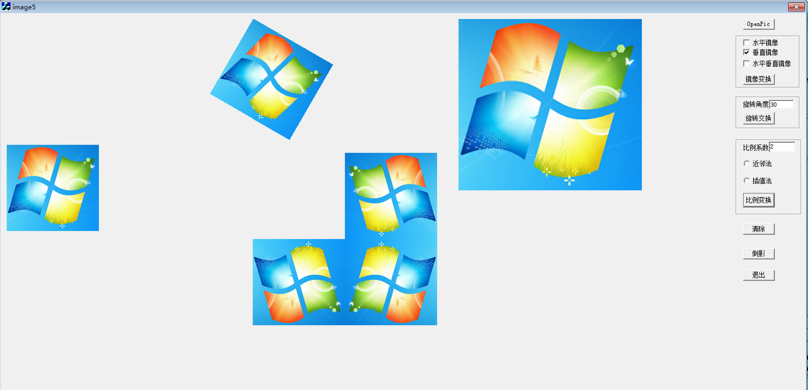

# 《数字图像处理》实验报告

## 实验六 彩色图像几何变换

---
学号： 2022211100        姓名：郭明轩

---

### 实验目的

- 了解正变换与逆变换的区别，了解变形变换。
- 掌握彩色图像的镜像、旋转、比例变换方法。
- 熟悉VC++6.0复选控件的使用方法。

### 实验内容

- 函数设计
    - 彩色图像的镜像变换函数：在函数中输出处理图像结果（下同）。
    - 彩色图像的旋转变换函数。
    - 彩色图像的比例变换函数。
- 功能设计:在实验一的基础上完成以下功能：
    - 镜像变换类型通过复选框输入，旋转角度及比例系数通过编辑框输入。
    - 通过多个命令按钮分别实现镜像、旋转和比例变换。
    - 对垂直镜像的图像进行模糊处理，模拟倒影效果（选做）。
- 对图像进行变形变换（选做）。
    - 实验分析与讨论
    - 如何将镜像变换的结果与原图像连在一起？
    - 分析比较图像放大的近邻法与插值法的结果，设计将近邻法的结果变换为类似插值法的结果。

### 界面设计



### 功能设计

```cpp
#include <cmath> // 包含数学库以使用 sin 和 cos 函数

// 旋转图像
void Rotation(CDC *p, BYTE im[3][500][500], int h, int w, int d, int dx, int dy) {
    float cd = d * M_PI / 180; // 将角度转换为弧度
    int x1, y1;
    for (int y = 0; y < h; y++) {
        for (int x = 0; x < w; x++) {
            // 计算旋转后的坐标
            x1 = static_cast<int>(x * cos(cd) - y * sin(cd) + dx);
            y1 = static_cast<int>(x * sin(cd) + y * cos(cd) + dy);
            // 设置像素颜色
            COLORREF color = RGB(im[0][y][x], im[1][y][x], im[2][y][x]);
            p->SetPixel(x1, y1, color);
            p->SetPixel(x1 + 1, y1, color);
            p->SetPixel(x1, y1 + 1, color);
        }
    }
}

// 缩放图像
void Scale(CDC *p, BYTE im[3][500][500], int h, int w, float s) {
    float x1, y1;
    for (int y = 0; y < h - s / 2; y++) {
        for (int x = 0; x < w - s / 2; x++) {
            x1 = s * x;
            y1 = s * y;
            COLORREF color = RGB(im[0][y][x], im[1][y][x], im[2][y][x]);
            if (s <= 1) {
                // 缩小图像
                p->SetPixel(static_cast<int>(x1), static_cast<int>(y1), color);
            } else {
                // 放大图像
                for (int j = 0; j < s; j++) {
                    for (int i = 0; i < s; i++) {
                        p->SetPixel(static_cast<int>(x1 + i), static_cast<int>(y1 + j), color);
                    }
                }
            }
        }
    }
}

// 放大图像并进行双线性插值
void Enlarge(CDC *pDC, BYTE im[3][500][500], int h, int w, float s) {
    float x1, y1, c1, c2;
    BYTE C[3];
    for (int y = 0; y < h - 1; y++) {
        for (int x = 0; x < w - 1; x++) {
            x1 = s * x;
            y1 = s * y;
            for (int j = 0; j < s; j++) {
                for (int i = 0; i < s; i++) {
                    for (int k = 0; k < 3; k++) {
                        // 计算插值
                        c1 = i / (s - 1) * (im[k][y][x + 1] - im[k][y][x]) + im[k][y][x];
                        c2 = i / (s - 1) * (im[k][y + 1][x + 1] - im[k][y + 1][x]) + im[k][y + 1][x];
                        C[k] = static_cast<BYTE>(j / (s - 1) * (c2 - c1) + c1);
                    }
                    pDC->SetPixel(static_cast<int>(x1 + i), static_cast<int>(y1 + j), RGB(C[0], C[1], C[2]));
                }
            }
        }
    }
}

// 平滑图像
void Smooth(BYTE im[3][500][500], int h, int w, int n, BYTE put[3][500][500]) {
    for (int y = 0; y < h; y++) {
        for (int x = 0; x < w; x++) {
            for (int k = 0; k < 3; k++) {
                float s = 0;
                // 计算邻域内的平均值
                for (int i = -n; i <= n; i++) {
                    for (int j = -n; j <= n; j++) {
                        s += im[k][std::min(std::max(y + j, 0), h - 1)][std::min(std::max(x + i, 0), w - 1)];
                    }
                }
                put[k][y][x] = static_cast<BYTE>(s / ((2 * n + 1) * (2 * n + 1)));
            }
        }
    }
}

```


## 实验分析与讨论
1. **如何将镜像变换的结果与原图像连在一起？**
   - 可以通过将镜像变换后的图像与原图像进行拼接。具体方法是将镜像变换后的图像放置在原图像的旁边或下方。

2. **分析比较图像放大的近邻法与插值法的结果，设计将近邻法的结果变换为类似插值法的结果。**
   - **近邻法**：简单地将原图像中的像素直接复制到放大后的图像中，导致放大后的图像出现明显的锯齿状边缘。
   - **插值法**（如双线性插值）：通过计算相邻像素的加权平均值来生成新的像素值，使得放大后的图像边缘更加平滑。
   - **改进近邻法**：可以在近邻法的基础上，对放大后的图像进行一次平滑处理（如使用高斯模糊），以减少锯齿状边缘，使其更接近插值法的效果。

## 实验总结
通过本次实验，我们深入理解了图像处理中的基本变换方法，包括镜像、旋转和比例变换。同时，我们也掌握了如何在VC++6.0环境中使用复选控件和编辑框来实现用户交互。实验中涉及的图像处理算法，如旋转、缩放和插值，展示了不同方法在图像放大和变形中的应用效果。

在实验过程中，我们还探讨了如何将镜像变换的结果与原图像拼接，以及如何改进近邻法以获得更平滑的放大效果。这些讨论和实践不仅加深了我们对图像处理技术的理解，也为未来的图像处理项目提供了宝贵的经验。本次实验帮助我们掌握了图像处理的基本技能，并为未来的学习和研究打下了坚实的基础。