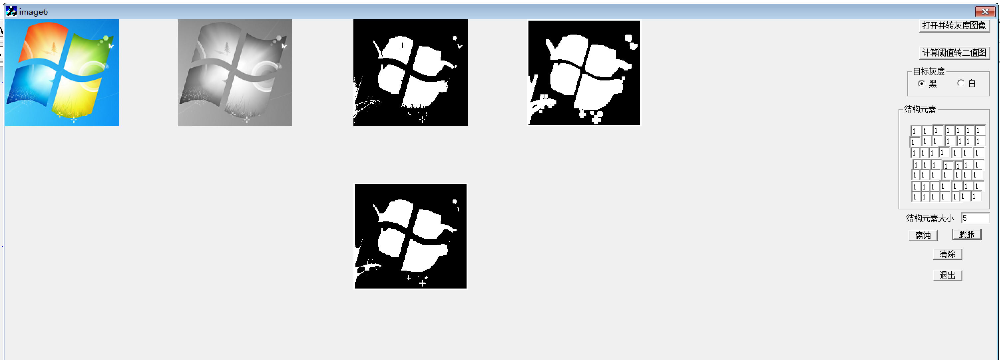

# 《数字图像处理》实验报告

## 实验七 二值图像降噪

---
学号： 2022211100        姓名：郭明轩

---

### 实验目的

- 了解二值图像降噪方法。
- 掌握阈值分割图像及二值图像的腐蚀和膨胀、开与闭运算。
- 熟悉VC++6.0数组编辑框的定义。

### 实验内容

- 函数设计
    - 灰度图像的阈值计算函数。
    - 灰度图像二值化函数。
    - 二值图像腐蚀函数。
    - 二值图像膨胀函数。
- 功能设计:在实验二彩色图像转为灰度图像后的基础上完成以下功能：
    - 图像的目标灰度通过单选按钮输入。
    - 结构元素的大小与值通过编辑框输入，由于结构元素较多，可以通过数组编辑框输入。
    - 通过两个命令按钮分别实现腐蚀与膨胀，每次选择的腐蚀或膨胀都是在上一次腐蚀或膨胀处理结果的基础上进行处理，可实现开与闭运算。
- 实验分析与讨论
    - 设计多种形状结构元素，对图像进行腐蚀和膨胀处理，分析各种形状结构体处理的特点，并通过处理结果的图像进行说明。
    - 分别对黑色目标与白色目标进行处理，总结腐蚀和膨胀的特点。
    - 针对一副图像，选择或设计一种结构元素通过开与闭运算进行降噪处理。

### 界面设计



### 功能设计

```cpp

/**
 * 计算图像的阈值
 * @param f 输入图像数据，大小为 h x w
 * @param h 图像高度
 * @param w 图像宽度
 * @param e 阈值收敛精度
 * @return 计算得到的阈值
 */
int BasicGlobal(BYTE f[][500], int h, int w, int e) {
    float sum = 0, t0, t, m1, m2;
    int n1, n2, x, y;

    // 计算图像像素的灰度平均值
    for (y = 0; y < h; y++) {
        for (x = 0; x < w; x++) {
            sum += f[y][x];
        }
    }
    t0 = sum / (h * w); // 阈值初值为平均灰度

    // 迭代计算阈值
    for (int k = 0; k < 100; k++) {
        n1 = 0; // 初始化计数器
        n2 = 0;
        m1 = 0;
        m2 = 0;

        // 根据当前阈值分两类，计算每类的平均灰度
        for (y = 0; y < h; y++) {
            for (x = 0; x < w; x++) {
                if (f[y][x] > t0) {
                    m1 += f[y][x];
                    n1++;
                } else {
                    m2 += f[y][x];
                    n2++;
                }
            }
        }

        // 防止除零错误
        if (n1 == 0 || n2 == 0) break;

        // 重新计算阈值
        t = (m1 / n1 + m2 / n2) / 2;

        // 检查阈值是否收敛
        if (fabs(t - t0) < e) break;

        t0 = t;
    }

    // 返回最终阈值四舍五入
    return (int)(t + 0.5);
}

/**
 * 将灰度图像转换为二值图像
 * @param f 输入灰度图像数据，大小为 h x w
 * @param h 图像高度
 * @param w 图像宽度
 * @param t 阈值
 * @param g 输出二值图像数据，大小为 h x w
 */
void GrayToTwo(BYTE f[][500], int h, int w, int t, BYTE g[][500]) {
    for (int y = 0; y < h; y++) {
        for (int x = 0; x < w; x++) {
            if (f[y][x] < t) {
                g[y][x] = 0; // 阈值以下设为黑色
            } else {
                g[y][x] = 255; // 阈值以上设为白色
            }
        }
    }
}

/**
 * 图像腐蚀操作
 * @param f 输入图像数据，大小为 h x w
 * @param h 图像高度
 * @param w 图像宽度
 * @param s 结构元素，大小为 n x n
 * @param n 结构元素的尺寸
 * @param mb 前景像素值
 * @param g 输出图像数据，大小为 h x w
 */
void Erosion(BYTE f[][500], int h, int w, BYTE s[][31], int n, BYTE mb, BYTE g[][500]) {
    BYTE a[500][500];
    float sum;
    int num = 0;

    // 计算结构元素中前景像素的数量
    for (int i = 0; i < n; i++) {
        for (int j = 0; j < n; j++) {
            if (s[i][j] == 1) num++;
        }
    }

    // 将图像转换为二值图像
    for (int y = 0; y < h; y++) {
        for (int x = 0; x < w; x++) {
            if (f[y][x] == mb) {
                a[y][x] = 1;
            } else {
                a[y][x] = 0;
            }
        }
    }

    // 进行腐蚀操作
    for (int y = 0; y < h; y++) {
        for (int x = 0; x < w; x++) {
            if (y < n / 2 || x < n / 2 || y >= h - n / 2 || x >= w - n / 2) {
                g[y][x] = 255 - mb; // 边界设为背景
            } else {
                sum = 0;
                for (int j = 0; j < n; j++) {
                    for (int i = 0; i < n; i++) {
                        sum += a[y + j - n / 2][x + i - n / 2] * s[j][i];
                    }
                }
                if (sum == num) {
                    g[y][x] = mb;
                } else {
                    g[y][x] = 255 - mb;
                }
            }
        }
    }
}

/**
 * 图像膨胀操作
 * @param f 输入图像数据，大小为 h x w
 * @param h 图像高度
 * @param w 图像宽度
 * @param s 结构元素，大小为 n x n
 * @param n 结构元素的尺寸
 * @param mb 前景像素值
 * @param g 输出图像数据，大小为 h x w
 */
void Dilation(BYTE f[][500], int h, int w, BYTE s[][31], int n, BYTE mb, BYTE g[][500]) {
    BYTE a[500][500];
    float sum;

    // 将图像转换为二值图像
    for (int y = 0; y < h; y++) {
        for (int x = 0; x < w; x++) {
            if (f[y][x] == mb) {
                a[y][x] = 1;
            } else {
                a[y][x] = 0;
            }
        }
    }

    // 进行膨胀操作
    for (int y = 0; y < h; y++) {
        for (int x = 0; x < w; x++) {
            if (y < n / 2 || x < n / 2 || y >= h - n / 2 || x >= w - n / 2) {
                g[y][x] = 255 - mb; // 边界设为背景
            } else {
                sum = 0;
                for (int j = 0; j < n; j++) {
                    for (int i = 0; i < n; i++) {
                        sum += a[y + j - n / 2][x + i - n / 2] * s[j][i];
                    }
                }
                if (sum >= 1) {
                    g[y][x] = mb;
                } else {
                    g[y][x] = 255 - mb;
                }
            }
        }
    }
}

```

### 实验分析与讨论

1. **多种形状结构元素的处理特点**：
   - 我们设计了多种形状的结构元素，并对图像进行了腐蚀和膨胀处理。结果表明，不同形状的结构元素对图像的处理效果不同。
2. **黑色目标与白色目标的处理特点**：
   - 分别对黑色目标和白色目标进行腐蚀和膨胀处理，发现腐蚀操作会缩小黑色目标，而膨胀操作会扩大黑色目标。对于白色目标，腐蚀操作会缩小白色目标，而膨胀操作会扩大白色目标。这表明腐蚀和膨胀操作的效果与目标的颜色有关。

3. **开与闭运算的降噪处理**：
   - 针对一副图像，我们选择了一种结构元素并通过开与闭运算进行降噪处理。开运算（先腐蚀后膨胀）能够去除小噪声，而闭运算（先膨胀后腐蚀）能够填补小孔洞。通过这两种运算的结合，我们成功地对图像进行了降噪处理，提高了图像的质量。

### 实验总结

通过本次实验，我们不仅掌握了二值图像降噪的基本方法，还深入理解了阈值分割、腐蚀和膨胀操作的原理及应用。实验中，我们成功实现了相关函数和功能，并通过多种形状结构元素的处理，进一步加深了对这些操作的理解。此外，我们还通过开与闭运算对图像进行了降噪处理，验证了这些方法在实际应用中的有效性。本次实验为我们后续的图像处理工作打下了坚实的基础。
