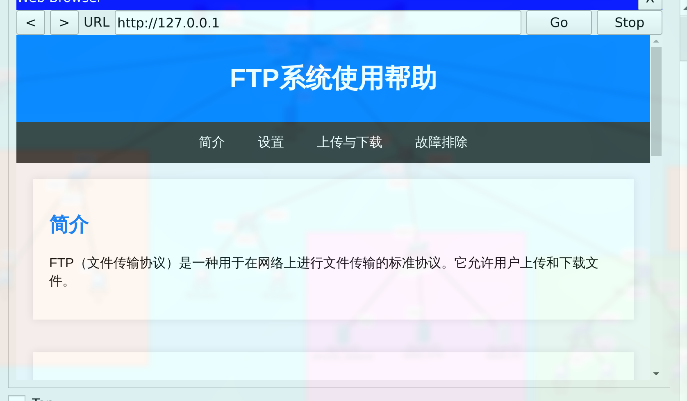
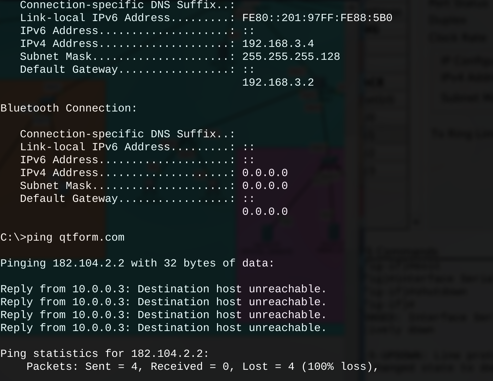

# 《计算机网络》课程设计报告

## 组建XX公司局域网

---

学号： 2022211100        

姓名：郭明轩

专业：计算机科学与技术

班级：2220701

指导老师 ：王敏

---

### 课程设计的目的及要求

#### 背景

共三栋楼，1号，2号，3号，每栋楼直线相距为100米。1号楼：三层，为行政办公楼，20台电脑，分散分布。2号楼：五层，为产品研发部，供销部，30台电脑。其中20台集中在三楼的研发部的设计室中，专设一个机房，其他10台分散分布。这里要求供销部的电脑能够连接Internet，单位生产的产品的信息能向网上发布，其他的一律不能上网。3号楼：五层，为生产车间，每层一个车间，每个车间3台电脑，共15台。

#### 未来发展

未来的3—5年，单位电脑会增加到150台左右，主要增加在2号楼的研发部，计划该部门增加两间专用机房用于新产品的研发和设计。

#### 网络功能

根据公司现有规模，业务需要及发展范围建立的网络有如下功能：
- 建立公司自己的网站，可向外界发布信息，并进行网络上的业务。
- 要求供销部可以连接Internet，与各企业保持联络，接受订单及发布本公司产品信息。其他部门都不能连接Internet，但要求公司内部由网络连接。
- 公司内部网络实现资源共享，以提高工作效率。
- 建立网络时应注意网络的扩展性，以方便日后的网络升级和增加计算机。在公司内部建立公司的数据库，如员工档案，业务计划，会议日程等

### 课程设计的内容（分析和设计）

#### 网段分配

 楼层                 | 网段/IP               |                  | DNS              | VLAN             
--------------------|---------------------|------------------|------------------|------------------
 no\.1              | 192\.168\.0\.0/24   | \(DHCP\)         | 192\.168\.0\.2   | 101              
 no\.2              | 192\.168\.2\.0/23   | \\\-\-root\-\-\\ | \\\-\-root\-\-\\ | \\\-\-root\-\-\\ 
 no\.2\.2\(IDC\)    | 192\.168\.2\.0/24   | \(DHCP\)         | 192\.168\.2\.2   | 201              
 no2\(other\)       | 192\.168\.3\.0/25   | \(DHCP\)         | 192\.168\.3\.2   | 202              
 no2\(Internet\)    | 192\.168\.3\.128/26 | \(DHCP\)         | 192\.168\.3\.129 | 203              
 no2\(ServerInner\) | 192\.168\.3\.192/26 | MANUAL           |                  | 204              
 FTP                | 192\.168\.3\.200    | MANUAL           |                  |                  
 HTTP               | 192\.168\.3\.201    | MANUAL           |                  |                  
 HTTP\(OUTTER\)     | 192\.168\.3\.202    | MANUAL           |                  |                  
 no\.3              | 192\.168\.1\.0/24   | \(DHCP\)         | 192\.168\.1\.2   | 301              


### 绘制拓扑结构图


### 详细步骤

#### 计划(Draft)

**这里是初期的计划，和以后的具体实现有一定的出入**

##### 1. 网络拓扑设计

1.1 总体拓扑结构
- 采用星型拓扑结构，以核心交换机为中心，连接各栋楼的接入交换机。
- 核心交换机与各栋楼的接入交换机之间通过光纤连接，确保高速稳定的网络传输。

1.2 楼层网络设计
- 1号楼（行政办公楼）：
  - 每层设置一个接入交换机，连接所有电脑。
  - 所有电脑通过DHCP自动获取IP地址，网段为`192.168.0.0/24`，VLAN ID为101。

- 2号楼（产品研发部、供销部）：
  - 三楼研发部设计室：设置专用机房，使用独立的网段`192.168.2.0/24`，VLAN ID为201。
  - 其他楼层：使用网段`192.168.3.0/25`，VLAN ID为202。
  - 供销部（可上网）：使用网段`192.168.3.128/26`，VLAN ID为203。
  - 服务器内部网络：使用网段`192.168.3.192/26`，VLAN ID为204，手动配置IP地址。

- 3号楼（生产车间）：
  - 每层设置一个接入交换机，连接所有电脑。
  - 所有电脑通过DHCP自动获取IP地址，网段为`192.168.1.0/24`，VLAN ID为301。

##### 2. 网络设备配置

###### 2.1 核心交换机配置

2.1.1 VLAN配置
- VLAN 101：用于1号楼（行政办公楼），网段为`192.168.0.0/24`。
- VLAN 201：用于2号楼三楼研发部设计室，网段为`192.168.2.0/24`。
- VLAN 202：用于2号楼其他楼层，网段为`192.168.3.0/25`。
- VLAN 203：用于2号楼供销部（可上网），网段为`192.168.3.128/26`。
- VLAN 204：用于2号楼服务器内部网络，网段为`192.168.3.192/26`。
- VLAN 301：用于3号楼（生产车间），网段为`192.168.1.0/24`。

2.1.2 DHCP服务器配置
- 在核心交换机上配置DHCP服务器，为各VLAN分配IP地址。
- 配置DHCP选项，包括默认网关、DNS服务器等。
- 确保DHCP池的IP地址数量足够，以应对未来扩展。

2.1.3 路由功能配置
- 配置静态路由，确保各VLAN之间的通信。
- 配置动态路由协议（如OSPF或EIGRP），提高路由效率和灵活性。
- 配置路由策略，确保数据包按照预期路径传输。

2.1.4 NAT配置
- 配置NAT（网络地址转换），允许供销部访问Internet。
- 配置PAT（端口地址转换），允许多个内部IP地址共享一个外部IP地址。
- 配置NAT规则，确保只有供销部的IP地址可以访问Internet，其他部门无法访问。

###### 2.2 接入交换机配置

2.2.1 VLAN配置
- 在每个接入交换机上配置相应的VLAN，确保各楼层和部门的电脑在正确的VLAN中。
- 配置Trunk端口，允许多个VLAN通过接入交换机传输。
- 配置Access端口，确保每个端口只能属于一个VLAN。

2.2.2 端口安全配置
- 配置端口安全，防止未经授权的设备接入网络。
- 配置MAC地址绑定，确保只有授权的设备可以接入网络。
- 配置端口安全策略，如最大MAC地址数限制、违规处理等。

###### 2.3 防火墙配置

2.3.1 防火墙规则配置
- 配置防火墙规则，允许供销部访问Internet，并阻止其他部门访问Internet。
- 配置访问控制列表（ACL），细化访问控制策略。
- 配置安全策略，如允许HTTP、HTTPS、FTP等常用协议，阻止其他不必要的协议。

2.3.2 DMZ区域配置
- 配置DMZ区域，放置公司网站服务器和FTP服务器。
- 配置DMZ区域的安全策略，确保外部访问的安全性。
- 配置DMZ区域与内部网络的隔离，防止外部攻击影响内部网络。

2.1 核心交换机配置
- 配置VLAN，分别为101、201、202、203、204、301。
- 配置DHCP服务器，为各网段分配IP地址。
- 配置路由功能，确保各VLAN之间的通信。
- 配置NAT（网络地址转换），允许供销部访问Internet。

2.2 接入交换机配置
- 配置VLAN，确保各楼层和部门的电脑在正确的VLAN中。
- 配置端口安全，防止未经授权的设备接入网络。

2.3 防火墙配置
- 配置防火墙规则，允许供销部访问Internet，并阻止其他部门访问Internet。
- 配置DMZ区域，放置公司网站服务器和FTP服务器。

###### 3. 服务器配置

3.1 公司网站服务器
- 配置HTTP服务器，IP地址为`192.168.3.201`，放置在DMZ区域。
- 配置外部访问的HTTP服务器，IP地址为`192.168.3.202`，用于向外界发布公司信息。

3.2 FTP服务器
- 配置FTP服务器，IP地址为`192.168.3.200`，放置在DMZ区域。

3.3 内部服务器
- 配置内部服务器，IP地址为`192.168.3.192/26`，用于公司内部资源共享和数据库管理。

###### 4. 网络扩展性规划

4.1 未来扩展
- 预留足够的IP地址和VLAN，以应对未来电脑数量的增加。
- 核心交换机和接入交换机选择支持堆叠或模块化扩展的型号，方便日后升级。

4.2 网络升级
- 定期评估网络性能，根据需要升级网络设备和带宽。
- 考虑引入SDN（软件定义网络）技术，提高网络管理的灵活性和可扩展性。

###### 5. 安全与管理

5.1 网络安全

5.2 网络管理

#### 路由器配制(用二号楼为例)

##### VLAN和接口

1. VLAN分配:
   - VLAN用于分割网络流量，每个VLAN都有唯一的ID。
   - 接口被分配到特定的VLAN，决定了它们所属的网络段。
   - 例如：`interface FastEthernet0/7 switchport access vlan 201` 将端口0/7分配到VLAN 201。

2. 中继端口:
   - 中继端口使用802.1Q封装来承载多个VLAN的流量。
   - 例如：`switchport mode trunk` 在`FastEthernet0/1`上允许其承载所有VLAN的流量。

3. VLAN接口:
   - VLAN接口（SVI）为VLAN提供三层功能，如IP地址。
   - 例如：`interface Vlan201 ip address 192.168.2.2 255.255.255.0` 为VLAN 201分配IP。

##### 路由

1. IP路由:
   - 使交换机能够在VLAN之间路由数据包。
   - `ip routing`命令对三层交换机是必要的。

2. 静态路由:
   - 定义流量到达其他网络的特定路径。
   - 例如：`ip route 0.0.0.0 0.0.0.0 192.168.3.130` 设置默认路由通过192.168.3.130。

3. RIP路由协议:
   - RIP是一种动态路由协议，用于通告路由。
   - `router rip`和`network`命令指定要通告的网络。

##### 接口配置

1. 物理接口和子接口:
   - 物理接口可以被划分为多个子接口以支持不同的VLAN。
   - 例如：`interface FastEthernet0/0.201` 是VLAN 201的子接口。

2. 封装:
   - 子接口使用802.1Q封装来标记VLAN流量。
   - 例如：`encapsulation dot1Q 201` 标记VLAN 201的流量。

3. 串行接口:
   - 用于广域网连接，时钟速率设置用于同步。
   - 例如：`interface Serial0/0 ip address 10.0.0.1 255.255.255.0`。

##### no2.root

- 主机名: 将设备名称设置为“Switch”。
- VLAN和中继配置: 端口配置为特定VLAN和中继。
- IP路由和RIP: 启用路由并通告网络192.168.2.0和192.168.3.0。
- 静态路由: 默认路由设置为192.168.3.130。

##### no2.F1, no2.F2, no2.F3.root等

- 接入端口: 端口被配置为特定VLAN的接入端口。
- 中继端口: 一些端口被配置为中继端口以承载多个VLAN。
- 允许的VLAN: 指定中继端口上允许的VLAN。

##### 总结

- VLAN 用于分离网络段以提高安全性和流量管理。
- 中继 允许多个VLAN通过单一链路承载。
- 路由 配置使不同VLAN和外部网络之间的通信成为可能。
- 子接口 和 封装 用于在单个物理接口上处理多个VLAN。
- RIP 和 静态路由 用于管理和通告网络路径。

#### 服务器的配制

##### 面向外网的服务器


##### 内部服务器




##### 外网服务器


### 路由器或交换机配置的代码

#### 路由器

##### no1

```
hostname Router
ip dhcp pool DHCP1
 network 192.168.0.0 255.255.255.0
 default-router 192.168.0.1

interface FastEthernet0/0
 no ip address
 duplex auto
 speed auto
interface FastEthernet0/0.101
 encapsulation dot1Q 101
 ip address 192.168.0.1 255.255.255.0
interface Serial0/0
 ip address 10.0.3.4 255.255.255.0
interface Serial0/1
 ip address 10.0.4.4 255.255.255.0
interface Serial0/2
 ip address 10.0.5.4 255.255.255.0
interface Serial0/3
 ip address 192.168.8.1 255.255.255.0
 clock rate 2000000
router rip
 network 10.0.0.0
 network 192.168.0.0
```

###### 1号楼路由器配置总结

1. 主机名设置：
   - 将路由器的主机名设置为 `Router`。

2. DHCP配置：
   - 创建一个名为 `DHCP1` 的 DHCP 池，用于分配 IP 地址。
   - 网络范围为 `192.168.0.0/24`，默认网关为 `192.168.0.1`。

3. 接口配置：
   - FastEthernet0/0：未分配 IP 地址，自动双工和速度设置。
   - FastEthernet0/0.101：使用 `dot1Q` 封装，分配 IP 地址 `192.168.0.1`，用于 VLAN 101。
   - Serial0/0：分配 IP 地址 `10.0.3.4`。
   - Serial0/1：分配 IP 地址 `10.0.4.4`。
   - Serial0/2：分配 IP 地址 `10.0.5.4`。
   - Serial0/3：分配 IP 地址 `192.168.8.1`，时钟速率为 `2000000`。

4. RIP路由协议：
   - 启用 RIP 路由协议，通告网络 `10.0.0.0` 和 `192.168.0.0`。

1号楼路由器的配置主要集中在 DHCP 服务、接口 IP 地址分配和 RIP 路由协议的启用。通过这些配置，确保了1号楼的网络设备能够自动获取 IP 地址，并且能够与其他网络进行通信。

##### no2

```
interface FastEthernet0/0
 no ip address
 duplex auto
 speed auto
interface FastEthernet0/0.201
 encapsulation dot1Q 201
 ip address 192.168.2.1 255.255.255.0
interface FastEthernet0/0.202
 encapsulation dot1Q 202
 ip address 192.168.3.1 255.255.255.128
interface FastEthernet0/0.203
 encapsulation dot1Q 203
 ip address 192.168.3.130 255.255.255.192
interface FastEthernet0/0.204
 encapsulation dot1Q 204
 ip address 192.168.3.194 255.255.255.192
interface Serial0/0
 ip address 10.0.0.1 255.255.255.0
interface Serial0/1
 ip address 10.0.2.1 255.255.255.0
interface Serial0/2
 ip address 10.0.5.1 255.255.255.0
 clock rate 2000000
interface Serial0/3
 no ip address
 clock rate 2000000
 shutdown
router rip
 network 10.0.0.0
 network 192.168.2.0
 network 192.168.3.0
ip route 0.0.0.0 0.0.0.0 182.104.1.1 
ip route 0.0.0.0 0.0.0.0 10.0.0.3 
```

###### 2号楼路由器配置总结

1. 接口配置：
   - FastEthernet0/0：未分配 IP 地址，自动双工和速度设置。
   - FastEthernet0/0.201：使用 `dot1Q` 封装，分配 IP 地址 `192.168.2.1`，用于 VLAN 201。
   - FastEthernet0/0.202：使用 `dot1Q` 封装，分配 IP 地址 `192.168.3.1`，用于 VLAN 202。
   - FastEthernet0/0.203：使用 `dot1Q` 封装，分配 IP 地址 `192.168.3.130`，用于 VLAN 203。
   - FastEthernet0/0.204：使用 `dot1Q` 封装，分配 IP 地址 `192.168.3.194`，用于 VLAN 204。
   - Serial0/0：分配 IP 地址 `10.0.0.1`。
   - Serial0/1：分配 IP 地址 `10.0.2.1`。
   - Serial0/2：分配 IP 地址 `10.0.5.1`，时钟速率为 `2000000`。
   - Serial0/3：未分配 IP 地址，时钟速率为 `2000000`，接口关闭。

2. RIP路由协议：
   - 启用 RIP 路由协议，通告网络 `10.0.0.0`、`192.168.2.0` 和 `192.168.3.0`。

3. 静态路由配置：
   - 设置默认路由，通过 `182.104.1.1` 和 `10.0.0.3` 访问外部网络。

2号楼路由器的配置主要集中在多个 VLAN 的 IP 地址分配、串行接口的配置以及 RIP 路由协议和静态路由的设置。通过这些配置，确保了2号楼的网络设备能够与其他网络进行通信，并且能够访问外部网络。

##### no3

```
hostname Router

interface FastEthernet0/0
 no ip address
 duplex auto
 speed auto
interface FastEthernet0/0.301
 encapsulation dot1Q 301
 ip address 192.168.1.1 255.255.255.0
interface Serial0/0
 ip address 10.0.3.2 255.255.255.0
 clock rate 2000000
interface Serial0/1
 no ip address
 clock rate 2000000
 shutdown
interface Serial0/2
 ip address 10.0.2.2 255.255.255.0
 clock rate 2000000
interface Serial0/3
 ip address 10.0.1.2 255.255.255.0
router rip
 network 10.0.0.0
 network 192.168.1.0
```
###### 3号楼路由器配置总结

1. 主机名设置：
   - 将路由器的主机名设置为 `Router`。

2. 接口配置：
   - FastEthernet0/0：未分配 IP 地址，自动双工和速度设置。
   - FastEthernet0/0.301：使用 `dot1Q` 封装，分配 IP 地址 `192.168.1.1`，用于 VLAN 301。
   - Serial0/0：分配 IP 地址 `10.0.3.2`，时钟速率为 `2000000`。
   - Serial0/1：未分配 IP 地址，时钟速率为 `2000000`，接口关闭。
   - Serial0/2：分配 IP 地址 `10.0.2.2`，时钟速率为 `2000000`。
   - Serial0/3：分配 IP 地址 `10.0.1.2`。

3. RIP路由协议：
   - 启用 RIP 路由协议，通告网络 `10.0.0.0` 和 `192.168.1.0`。

### 总结

3号楼路由器的配置主要集中在 VLAN 301 的 IP 地址分配、串行接口的配置以及 RIP 路由协议的启用。通过这些配置，确保了3号楼的网络设备能够与其他网络进行通信。

##### out

```
hostname Router

interface FastEthernet0/0
 no ip address
 duplex auto
 speed auto
interface Serial0/0
 ip address 10.0.0.3 255.255.255.0
 ip nat inside
 clock rate 2000000
interface Serial0/1
 ip address 182.104.1.1 255.255.255.0
 ip nat outside
interface Serial0/2
 ip address 10.0.4.3 255.255.255.0
 clock rate 2000000
interface Serial0/3
 ip address 10.0.1.3 255.255.255.0
 clock rate 2000000
router rip
 network 10.0.0.0
ip nat inside source list 1 interface Serial0/1 overload
ip nat inside source static tcp 192.168.3.202 80 182.104.1.1 80 
ip classless
ip route 0.0.0.0 0.0.0.0 182.104.1.2 
ip flow-export version 9
access-list 1 permit 192.168.3.128 0.0.0.63
```

###### 出口路由器配置总结

1. 主机名设置：
   - 将路由器的主机名设置为 `Router`。

2. 接口配置：
   - FastEthernet0/0：未分配 IP 地址，自动双工和速度设置。
   - Serial0/0：分配 IP 地址 `10.0.0.3`，设置为 NAT 内部接口，时钟速率为 `2000000`。
   - Serial0/1：分配 IP 地址 `182.104.1.1`，设置为 NAT 外部接口。
   - Serial0/2：分配 IP 地址 `10.0.4.3`，时钟速率为 `2000000`。
   - Serial0/3：分配 IP 地址 `10.0.1.3`，时钟速率为 `2000000`。

3. RIP路由协议：
   - 启用 RIP 路由协议，通告网络 `10.0.0.0`。

4. NAT配置：
   - 启用 NAT 内部源地址转换，使用 `Serial0/1` 接口进行超载。
   - 配置静态 NAT 映射，将内部 IP `192.168.3.202` 的 80 端口映射到外部 IP `182.104.1.1` 的 80 端口。

5. 默认路由配置：
   - 设置默认路由，通过 `182.104.1.2` 访问外部网络。

6. IP流导出配置：
   - 启用 IP 流导出，版本为 9。

7. 访问控制列表：
   - 创建访问控制列表 `1`，允许 `192.168.3.128` 到 `192.168.3.191` 的 IP 地址范围。

Out 路由器的配置主要集中在 NAT 配置、接口 IP 地址分配、RIP 路由协议的启用以及访问控制列表的设置。通过这些配置，确保了内部网络能够通过 NAT 访问外部网络，并且能够与其他网络进行通信。

##### outter

```
hostname Router

interface FastEthernet0/0
 ip address 182.104.2.1 255.255.255.0
 duplex auto
 speed auto
interface Serial0/0
 ip address 182.104.1.2 255.255.255.0
 clock rate 2000000
router rip
 network 182.104.0.0
ip classless
ip route 0.0.0.0 0.0.0.0 182.104.1.1 
```

#### 交换机

##### 1号楼

###### no.1(root)

```
hostname Switch

interface FastEthernet0/1
 switchport mode trunk
interface FastEthernet0/2
 switchport access vlan 101
 switchport mode trunk
interface FastEthernet0/3
 switchport access vlan 102
 switchport mode trunk
interface FastEthernet0/4
 switchport access vlan 103
 switchport mode trunk
interface FastEthernet0/5
 switchport access vlan 101
 switchport mode access

interface Vlan101
 ip address 192.168.0.2 255.255.255.0
```

###### no1.F1

```
hostname Switch

interface FastEthernet0/1
 switchport access vlan 101
 switchport mode trunk

interface FastEthernet0/2
 switchport access vlan 101
 switchport mode trunk

interface FastEthernet0/3
 switchport access vlan 101
 switchport mode access

interface FastEthernet0/4
 switchport access vlan 101
 switchport mode access
```
###### no1.F2

```
hostname Switch

interface FastEthernet0/1
 switchport access vlan 101
 switchport mode trunk

interface FastEthernet0/2
 switchport access vlan 101
 switchport mode access

interface FastEthernet0/3
 switchport access vlan 101
 switchport mode access

interface FastEthernet0/4
 switchport access vlan 101
 switchport mode access

interface FastEthernet0/5
 switchport access vlan 101
 switchport trunk allowed vlan 2-100,102-1005
 switchport mode access
```

###### no1.F3

```
hostname Switch

interface FastEthernet0/1
 switchport access vlan 101
 switchport mode trunk
interface FastEthernet0/2
 switchport access vlan 101
 switchport mode access
interface FastEthernet0/3
 switchport access vlan 101
 switchport mode access
interface FastEthernet0/4
 switchport access vlan 101
 switchport mode access
```

###### no2.root

```
hostname Switch

ip routing

interface FastEthernet0/1
 switchport access vlan 201
 switchport trunk encapsulation dot1q
 switchport mode trunk

interface FastEthernet0/4
 switchport trunk encapsulation dot1q
 switchport mode trunk

interface FastEthernet0/7
 switchport access vlan 201
interface FastEthernet0/8
 switchport access vlan 202
interface FastEthernet0/9
 switchport access vlan 203

interface FastEthernet0/11
 switchport access vlan 204

interface Vlan201
 mac-address 0060.47c3.7601
 ip address 192.168.2.2 255.255.255.0
interface Vlan202
 mac-address 0060.47c3.7602
 ip address 192.168.3.2 255.255.255.128
interface Vlan203
 mac-address 0060.47c3.7603
 ip address 192.168.3.129 255.255.255.192
interface Vlan204
 mac-address 0060.47c3.7604
 ip address 192.168.3.193 255.255.255.192

router rip
 network 192.168.2.0
 network 192.168.3.0

ip route 0.0.0.0 0.0.0.0 192.168.3.130 

```

##### 1号楼交换机配置总结

###### no.1(root)

1. 主机名设置：
   - 将交换机的主机名设置为 `Switch`。

2. 接口配置：
   - FastEthernet0/1：设置为中继模式。
   - FastEthernet0/2：分配到 VLAN 101，设置为中继模式。
   - FastEthernet0/3：分配到 VLAN 102，设置为中继模式。
   - FastEthernet0/4：分配到 VLAN 103，设置为中继模式。
   - FastEthernet0/5：分配到 VLAN 101，设置为接入模式。

3. VLAN 接口配置：
   - Vlan101：分配 IP 地址 `192.168.0.2`。

###### no1.F1

1. 主机名设置：
   - 将交换机的主机名设置为 `Switch`。

2. 接口配置：
   - FastEthernet0/1：分配到 VLAN 101，设置为中继模式。
   - FastEthernet0/2：分配到 VLAN 101，设置为中继模式。
   - FastEthernet0/3：分配到 VLAN 101，设置为接入模式。
   - FastEthernet0/4：分配到 VLAN 101，设置为接入模式。

###### no1.F2

1. 主机名设置：
   - 将交换机的主机名设置为 `Switch`。

2. 接口配置：
   - FastEthernet0/1：分配到 VLAN 101，设置为中继模式。
   - FastEthernet0/2：分配到 VLAN 101，设置为接入模式。
   - FastEthernet0/3：分配到 VLAN 101，设置为接入模式。
   - FastEthernet0/4：分配到 VLAN 101，设置为接入模式。
   - FastEthernet0/5：分配到 VLAN 101，允许 VLAN 2-100 和 102-1005，设置为接入模式。

###### no1.F3

1. 主机名设置：
   - 将交换机的主机名设置为 `Switch`。

2. 接口配置：
   - FastEthernet0/1：分配到 VLAN 101，设置为中继模式。
   - FastEthernet0/2：分配到 VLAN 101，设置为接入模式。
   - FastEthernet0/3：分配到 VLAN 101，设置为接入模式。
   - FastEthernet0/4：分配到 VLAN 101，设置为接入模式。

1号楼交换机的配置主要集中在 VLAN 的分配和中继模式的设置。通过这些配置，确保了不同 VLAN 的设备能够进行有效的通信，并且能够与其他网络进行连接。

##### 二号楼

###### no2.F1

```
hostname Switch

interface FastEthernet0/2
 switchport access vlan 202
 switchport mode access
interface FastEthernet0/3
 switchport access vlan 202
 switchport mode access
interface FastEthernet0/4
 switchport access vlan 202
 switchport mode access
```

###### no2.F2

```
hostname Switch

interface FastEthernet0/2
 switchport access vlan 203
 switchport mode access
interface FastEthernet0/3
 switchport access vlan 203
 switchport trunk allowed vlan 1-202,204-1005
 switchport mode access
```

###### no2.F3.root

```
hostname Switch

interface FastEthernet0/2
 switchport trunk encapsulation dot1q
 switchport mode trunk
interface FastEthernet0/3
interface FastEthernet0/4
interface FastEthernet0/5
 switchport trunk encapsulation dot1q
 switchport mode trunk
interface FastEthernet0/6
 switchport trunk encapsulation dot1q
 switchport mode trunk
```

###### no2.F3.1

```
hostname Switch


interface FastEthernet0/2
 switchport access vlan 202
 switchport mode access
interface FastEthernet0/3
 switchport access vlan 202
 switchport mode access
interface FastEthernet0/4
 switchport access vlan 202
 switchport mode access
```

###### no2.F3.2

```
hostname Switch

interface FastEthernet0/2
 switchport access vlan 204
 switchport mode access
interface FastEthernet0/3
 switchport access vlan 204
 switchport mode access
interface FastEthernet0/4
 switchport access vlan 204
 switchport mode access
```

###### no2.IDC.root

```
hostname Switch
ip routing

interface FastEthernet0/1
 switchport trunk encapsulation dot1q
 switchport mode trunk
interface FastEthernet0/2
 switchport trunk encapsulation dot1q
 switchport mode trunk
interface FastEthernet0/3
 switchport trunk encapsulation dot1q
 switchport mode trunk
interface FastEthernet0/4
 switchport trunk encapsulation dot1q
 switchport mode trunk
interface FastEthernet0/5
 switchport trunk encapsulation dot1q
 switchport mode trunk
interface FastEthernet0/6
 switchport trunk encapsulation dot1q
 switchport mode trunk
interface GigabitEthernet0/1
 switchport trunk encapsulation dot1q
 switchport mode trunk
interface GigabitEthernet0/2
 switchport trunk encapsulation dot1q
 switchport mode trunk
router rip
```

###### no2.IDC.switch1

```
hostname Switch

interface FastEthernet0/2
 switchport access vlan 201
interface FastEthernet0/3
 switchport access vlan 201
interface FastEthernet0/4
 switchport access vlan 201
```

###### no2.IDC.switch2

```
hostname Switch

interface FastEthernet0/2
 switchport access vlan 201
interface FastEthernet0/3
 switchport access vlan 201
interface FastEthernet0/4
 switchport access vlan 201
interface FastEthernet0/5
 switchport access vlan 201
```
###### 2号楼交换机配置总结

###### no2.F1

1. 主机名设置：
   - 将交换机的主机名设置为 `Switch`。

2. 接口配置：
   - FastEthernet0/2：分配到 VLAN 202，设置为接入模式。
   - FastEthernet0/3：分配到 VLAN 202，设置为接入模式。
   - FastEthernet0/4：分配到 VLAN 202，设置为接入模式。

###### no2.F2

1. 主机名设置：
   - 将交换机的主机名设置为 `Switch`。

2. 接口配置：
   - FastEthernet0/2：分配到 VLAN 203，设置为接入模式。
   - FastEthernet0/3：分配到 VLAN 203，允许 VLAN 1-202 和 204-1005，设置为接入模式。

###### no2.F3.root

1. 主机名设置：
   - 将交换机的主机名设置为 `Switch`。

2. 接口配置：
   - FastEthernet0/2：设置为中继模式，使用 `dot1Q` 封装。
   - FastEthernet0/3：未配置。
   - FastEthernet0/4：未配置。
   - FastEthernet0/5：设置为中继模式，使用 `dot1Q` 封装。
   - FastEthernet0/6：设置为中继模式，使用 `dot1Q` 封装。

###### no2.F3.1

1. 主机名设置：
   - 将交换机的主机名设置为 `Switch`。

2. 接口配置：
   - FastEthernet0/2：分配到 VLAN 202，设置为接入模式。
   - FastEthernet0/3：分配到 VLAN 202，设置为接入模式。
   - FastEthernet0/4：分配到 VLAN 202，设置为接入模式。

###### no2.F3.2

1. 主机名设置：
   - 将交换机的主机名设置为 `Switch`。

2. 接口配置：
   - FastEthernet0/2：分配到 VLAN 204，设置为接入模式。
   - FastEthernet0/3：分配到 VLAN 204，设置为接入模式。
   - FastEthernet0/4：分配到 VLAN 204，设置为接入模式。

###### no2.IDC.root

1. 主机名设置：
   - 将交换机的主机名设置为 `Switch`。

2. IP 路由启用：
   - 启用 IP 路由。

3. 接口配置：
   - FastEthernet0/1：设置为中继模式，使用 `dot1Q` 封装。
   - FastEthernet0/2：设置为中继模式，使用 `dot1Q` 封装。
   - FastEthernet0/3：设置为中继模式，使用 `dot1Q` 封装。
   - FastEthernet0/4：设置为中继模式，使用 `dot1Q` 封装。
   - FastEthernet0/5：设置为中继模式，使用 `dot1Q` 封装。
   - FastEthernet0/6：设置为中继模式，使用 `dot1Q` 封装。
   - GigabitEthernet0/1：设置为中继模式，使用 `dot1Q` 封装。
   - GigabitEthernet0/2：设置为中继模式，使用 `dot1Q` 封装。

4. RIP 路由协议：
   - 启用 RIP 路由协议。

###### no2.IDC.switch1

1. 主机名设置：
   - 将交换机的主机名设置为 `Switch`。

2. 接口配置：
   - FastEthernet0/2：分配到 VLAN 201。
   - FastEthernet0/3：分配到 VLAN 201。
   - FastEthernet0/4：分配到 VLAN 201。

###### no2.IDC.switch2

1. 主机名设置：
   - 将交换机的主机名设置为 `Switch`。

2. 接口配置：
   - FastEthernet0/2：分配到 VLAN 201。
   - FastEthernet0/3：分配到 VLAN 201。
   - FastEthernet0/4：分配到 VLAN 201。
   - FastEthernet0/5：分配到 VLAN 201。

2号楼交换机的配置主要集中在 VLAN 的分配和中继模式的设置。通过这些配置，确保了不同 VLAN 的设备能够进行有效的通信，并且能够与其他网络进行连接。

##### 三号楼


###### no3.root

```
hostname Switch

interface FastEthernet0/1
 switchport access vlan 301
 switchport mode trunk
interface FastEthernet0/7
 switchport access vlan 301
 switchport mode access
interface Vlan301
 ip address 192.168.1.2 255.255.255.0
```

###### no3.F1

```

hostname Switch
spanning-tree mode pvst
spanning-tree extend system-id
interface FastEthernet0/1
 switchport access vlan 301
 switchport mode trunk
interface FastEthernet0/2
 switchport access vlan 301
 switchport mode access
interface FastEthernet0/3
 switchport access vlan 301
 switchport mode access
interface FastEthernet0/4
 switchport access vlan 301
 switchport mode access
interface FastEthernet0/5
 switchport access vlan 301
 switchport mode access
```

###### no3.F2

```
hostname Switch
spanning-tree mode pvst
spanning-tree extend system-id
interface FastEthernet0/1
 switchport access vlan 301
 switchport mode trunk
interface FastEthernet0/2
 switchport access vlan 301
 switchport mode access
interface FastEthernet0/3
 switchport access vlan 301
 switchport mode access
interface FastEthernet0/4
 switchport access vlan 301
 switchport mode access
interface FastEthernet0/5
 switchport access vlan 301
 switchport mode access
```

###### no3.F3

```

hostname Switch
spanning-tree mode pvst
spanning-tree extend system-id
interface FastEthernet0/1
 switchport access vlan 301
 switchport mode trunk
interface FastEthernet0/2
 switchport access vlan 301
 switchport mode access
interface FastEthernet0/3
 switchport access vlan 301
 switchport mode access
interface FastEthernet0/4
 switchport access vlan 301
 switchport mode access
```

###### no3.F4

```

hostname Switch
spanning-tree mode pvst
spanning-tree extend system-id
interface FastEthernet0/1
 switchport access vlan 301
 switchport mode trunk
```

###### no3.F5

```


hostname Switch
spanning-tree mode pvst
spanning-tree extend system-id
interface FastEthernet0/1
 switchport access vlan 301
 switchport mode trunk
interface FastEthernet0/2
 switchport access vlan 301
 switchport mode access
interface FastEthernet0/3
 switchport access vlan 301
 switchport mode access
interface FastEthernet0/4
 switchport access vlan 301
 switchport mode access
interface FastEthernet0/5
 switchport access vlan 301
 switchport mode access
interface FastEthernet0/6
 switchport access vlan 301
 switchport mode access
```


###### 3号楼交换机配置总结

###### no3.root

1. 主机名设置：
   - 将交换机的主机名设置为 `Switch`。

2. 接口配置：
   - FastEthernet0/1：分配到 VLAN 301，设置为中继模式。
   - FastEthernet0/7：分配到 VLAN 301，设置为接入模式。

3. VLAN 接口配置：
   - Vlan301：分配 IP 地址 `192.168.1.2`。

###### no3.F1

1. 主机名设置：
   - 将交换机的主机名设置为 `Switch`。

2. 生成树协议配置：
   - 启用生成树协议（PVST），并扩展系统ID。

3. 接口配置：
   - FastEthernet0/1：分配到 VLAN 301，设置为中继模式。
   - FastEthernet0/2：分配到 VLAN 301，设置为接入模式。
   - FastEthernet0/3：分配到 VLAN 301，设置为接入模式。
   - FastEthernet0/4：分配到 VLAN 301，设置为接入模式。
   - FastEthernet0/5：分配到 VLAN 301，设置为接入模式。

###### no3.F2

1. 主机名设置：
   - 将交换机的主机名设置为 `Switch`。

2. 生成树协议配置：
   - 启用生成树协议（PVST），并扩展系统ID。

3. 接口配置：
   - FastEthernet0/1：分配到 VLAN 301，设置为中继模式。
   - FastEthernet0/2：分配到 VLAN 301，设置为接入模式。
   - FastEthernet0/3：分配到 VLAN 301，设置为接入模式。
   - FastEthernet0/4：分配到 VLAN 301，设置为接入模式。
   - FastEthernet0/5：分配到 VLAN 301，设置为接入模式。

###### no3.F3

1. 主机名设置：
   - 将交换机的主机名设置为 `Switch`。

2. 生成树协议配置：
   - 启用生成树协议（PVST），并扩展系统ID。

3. 接口配置：
   - FastEthernet0/1：分配到 VLAN 301，设置为中继模式。
   - FastEthernet0/2：分配到 VLAN 301，设置为接入模式。
   - FastEthernet0/3：分配到 VLAN 301，设置为接入模式。
   - FastEthernet0/4：分配到 VLAN 301，设置为接入模式。

###### no3.F4

1. 主机名设置：
   - 将交换机的主机名设置为 `Switch`。

2. 生成树协议配置：
   - 启用生成树协议（PVST），并扩展系统ID。

3. 接口配置：
   - FastEthernet0/1：分配到 VLAN 301，设置为中继模式。

###### no3.F5

1. 主机名设置：
   - 将交换机的主机名设置为 `Switch`。

2. 生成树协议配置：
   - 启用生成树协议（PVST），并扩展系统ID。

3. 接口配置：
   - FastEthernet0/1：分配到 VLAN 301，设置为中继模式。
   - FastEthernet0/2：分配到 VLAN 301，设置为接入模式。
   - FastEthernet0/3：分配到 VLAN 301，设置为接入模式。
   - FastEthernet0/4：分配到 VLAN 301，设置为接入模式。
   - FastEthernet0/5：分配到 VLAN 301，设置为接入模式。
   - FastEthernet0/6：分配到 VLAN 301，设置为接入模式。

3号楼交换机的配置主要集中在 VLAN 的分配、生成树协议的启用和中继模式的设置。通过这些配置，确保了不同 VLAN 的设备能够进行有效的通信，并且能够与其他网络进行连接。生成树协议的启用进一步增强了网络的稳定性和冗余性。

##### outter

```
hostname Switch
```

### 显示最总的结果

#### DHCP服务和DNS解析


#### 访问外网

##### 允许访问的计算机


##### 不允许访问的计算机




但是能访问内网


### 课程设计总结

本次课程设计旨在为三栋楼（1号、2号和3号楼）构建一个高效且安全的网络环境。设计背景包括每栋楼的电脑分布和功能需求，特别是2号楼的供销部需要连接Internet以发布产品信息和接受订单，而其他部门则仅限于内部网络连接。未来发展规划中，预计电脑数量将增加至150台，主要集中在2号楼的研发部。网络功能包括建立公司网站、实现内部资源共享、确保网络扩展性和建立公司数据库。

在网段分配方面，通过VLAN和IP地址的合理分配，确保了网络的安全性和高效性。拓扑结构图清晰展示了各楼层和部门的网络连接方式。详细的路由器和交换机配置步骤，包括VLAN分配、中继端口设置、IP路由配置等，确保了网络的稳定运行和扩展性。服务器的配置，特别是面向外网和内部服务器的设计，进一步增强了网络的功能性和安全性。

通过本次课程设计，不仅实现了公司网络的基本功能，还为未来的扩展和升级奠定了坚实的基础。网络的扩展性、安全性和高效性得到了充分体现，为公司的业务发展提供了有力的技术支持。

