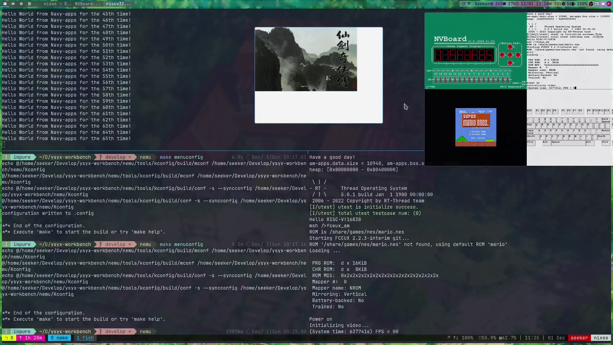
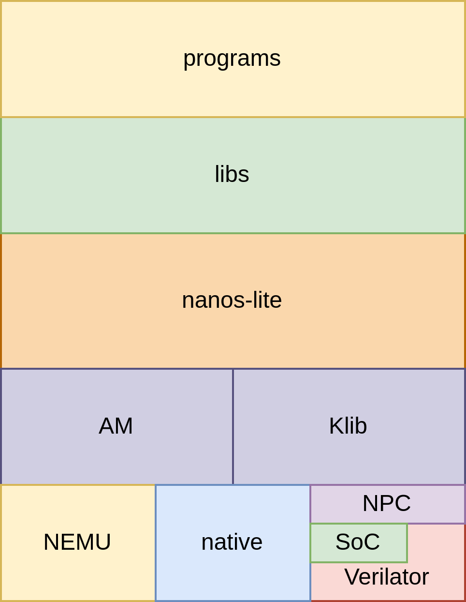
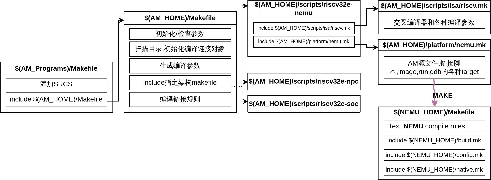
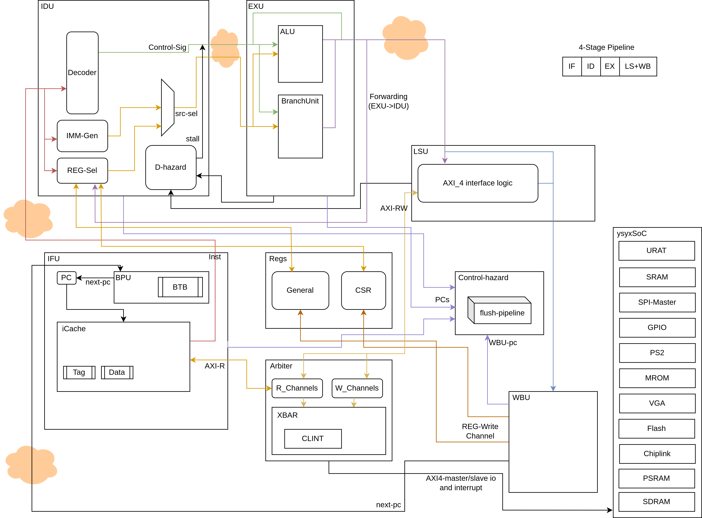
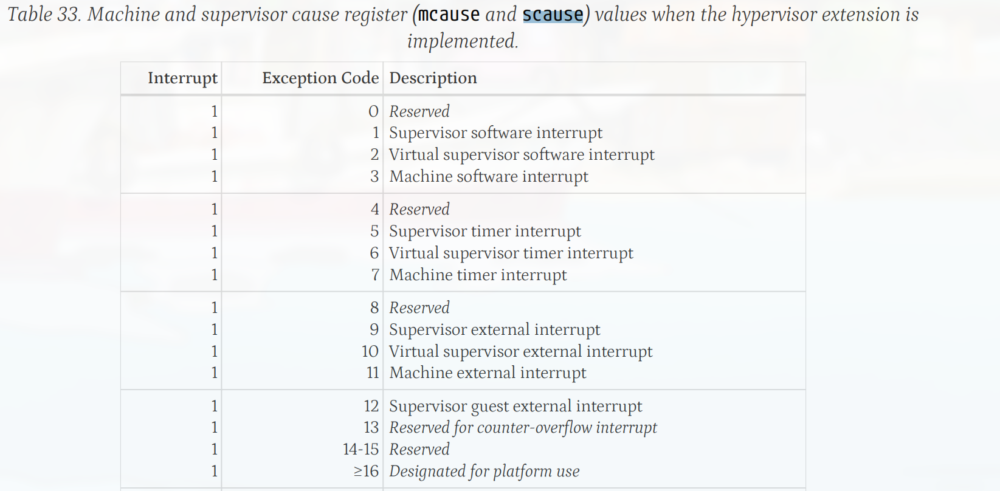
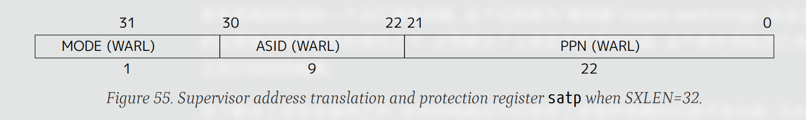
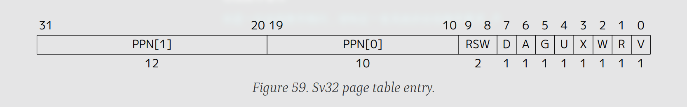
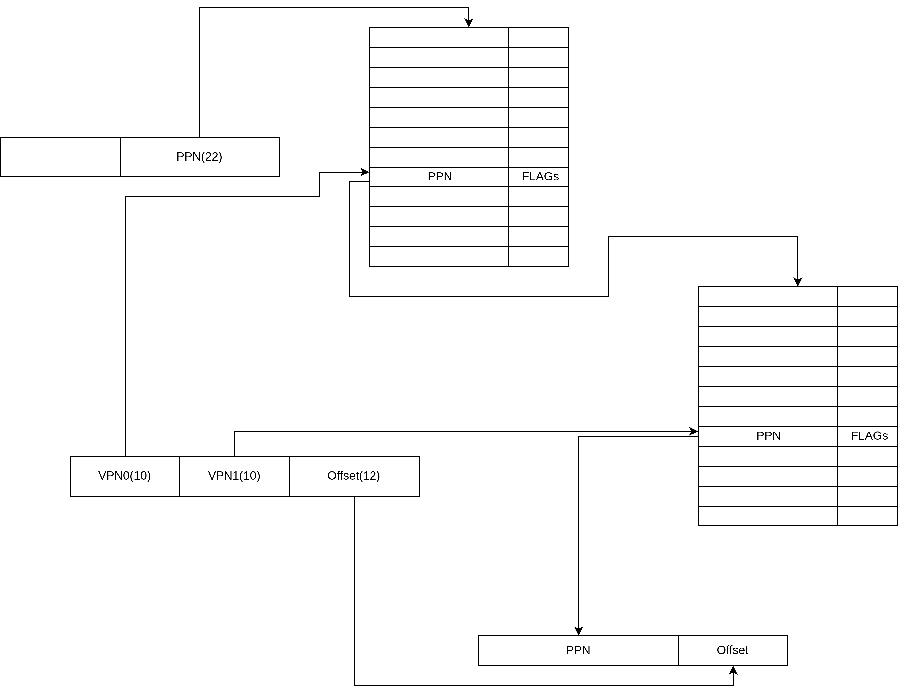

# 中断、异常、系统调用的设计与实现 on nanos-lite

---

学号： 2022211100        

姓名：郭明轩

专业：计算机科学与技术

班级：2220701

---

## 概述



演示视频:
【一生一芯-b线+NJU PA 完结纪念-从零开始创造属于你的计算机系统！】 https://www.bilibili.com/video/BV1GozdYSEgx/?share_source=copy_web

本次实验参考了南京大学 计算机科学与技术系 计算机系统基础 课程实验(NJU PA)和ysyx官方文档,从零开始实现了一个riscv架构的模拟器(支持vga,uart,serial,ps2keyboard)的模拟器(后文称nemu(NJU EMUlator)),使用chisel正确实现了riscv架构处理器核(后文称npc(New Processor Core))并且将其接入Soc(ysyxSoC),实现了一个软件层面的"抽象机"(后文称作Abstract Machine)使得基于抽象层开发的软件能被轻松移植到各种架构的机器上(native,riscv32e,riscv32,riscv64,mips,loongarch...),并且在抽象层之上实现了一个简单的操作系统(后文称作Nanos-lite),nanos-lite支持了异常\时钟中断\系统调用\虚拟内存\分时多任务,并且有一个简单的fs(文件系统)(后文称作sfs(Simple File System)),并且向nanos-lite上移植了标准库(Newlibc,libminiSDL,libfixedptc)等，并移植了pal,flappy-bird等游戏

本次实验使用 NixOS（一个 Linux 发行版）开发，使用 nix-devshell 创建了一个可复现的开发环境。该环境通过 `nixpkgs` 和 `flake-utils` 配置，定制了 `verilator` 5.008 版本和特定的 `yaml-cpp` 0.7.0 版本，并应用了必要的补丁。开发工具包括 `git`、`vim`、`gdb`、`gcc`、`python3` 等，以及图形处理的 `SDL2` 系列库。还包含 `ffmpeg`、`espresso`、`yosys`、`mill`、`llvm_18` 和 RISC-V 交叉编译工具链。Python 环境使用 `python312` 及其 `matplotlib` 和 `numpy` 包。性能和调试工具有 `ccache`、`gperftools`、`numactl`。设置了 `NIX_LD_LIBRARY_PATH`，包含多个必要库，并禁用了部分硬化选项，确保开发过程的稳定和可复现性，适用于复杂的软硬件协同开发。

**接下来,本次报告将主要围绕nanos-lite部分展开**

## 使用的基本概念和原理


## 总体设计







## 详细设计&&编码设计

详细的设计将由以下几个问题展开:

### AM = TRM + IOE + CTE + VME + MPE

**"程序在计算机上运行"的宏观视角: 计算机是个抽象层**

**"程序在计算机上运行"的微观视角: 计算机是个状态机**


- 基本环境抽象成TRM(Turing Machine) ,图灵机, 最简单的运行时环境, 为程序提供基本的计算能力
- 把上下文管理抽象成CTE(Context Extension)
- 输入输出扩展抽象成IOE(I/O Extension)
- 虚存扩展抽象成VME(Virtual Memory Extension)
- 多处理器扩展MPE(Multi-Processor Extension) - 没实现
- 上下文抽象成Context

```c
struct Context {
  uintptr_t gpr[NR_REGS], mcause, mstatus, mepc, mscratch;
  void *pdir;
};
```

#### AM-APIs

```c
// ----------------------- TRM: Turing Machine -----------------------
extern   Area        heap;
void     putch       (char ch);
void     halt        (int code) __attribute__((__noreturn__));

// -------------------- IOE: Input/Output Devices --------------------
bool     ioe_init    (void);
void     ioe_read    (int reg, void *buf);
void     ioe_write   (int reg, void *buf);
#include "amdev.h"

// ---------- CTE: Interrupt Handling and Context Switching ----------
bool     cte_init    (Context *(*handler)(Event ev, Context *ctx));//用于进行CTE相关的初始化操作. 其中它还接受一个来自操作系统的事件处理回调函数的指针, 当发生事件时, CTE将会把事件和相关的上下文作为参数, 来调用这个回调函数, 交由操作系统进行后续处理.
void     yield       (void);//用于进行自陷操作, 会触发一个编号为EVENT_YIELD事件. 不同的ISA会使用不同的自陷指令来触发自陷操作
bool     ienabled    (void);
void     iset        (bool enable);
Context *kcontext    (Area kstack, void (*entry)(void *), void *arg);
//创建内核线程-kstack是栈的范围, entry是内核线程的入口, arg则是内核线程的参数. 要求内核线程不能从entry返回,

// ----------------------- VME: Virtual Memory -----------------------
bool     vme_init    (void *(*pgalloc)(int), void (*pgfree)(void *));
void     protect     (AddrSpace *as);
void     unprotect   (AddrSpace *as);
void     map         (AddrSpace *as, void *vaddr, void *paddr, int prot);
Context *ucontext    (AddrSpace *as, Area kstack, void *entry);

// ---------------------- MPE: Multi-Processing ----------------------
bool     mpe_init    (void (*entry)());
int      cpu_count   (void);
int      cpu_current (void);
int      atomic_xchg (int *addr, int newval);

```

### 如何经行syscall/ecall?

首先,对于不同的ISA,异常的实现方式肯定不同,所以,应该对不同的ISA有不同的处理方式

具体到处理器应该如何执行,我们约定,在执行任意一条ecall的时候,必须先执行一次 cte_init (就如上文所述,在AM中,我们把上下文管理拓展抽象成了CTE),那么,在各个ISA就可以实现各自的设置了

```c
bool cte_init (Context *(*handler)(Event ev, Context *ctx)); //用于进行CTE相关的初始化操作. 其中它还接受一个来自操作系统的事件处理回调函数的指针, 当发生事件时, CTE将会把事件和相关的上下文作为参数, 来调用这个回调函数, 交由操作系统进行后续处理.

```

#### 对于riscv

##### 软件部分

在riscv中,有一个专门的CSR寄存器叫做mtvec,参考riscv-instruction manual:`The mtvec register is an MXLEN-bit WARL read/write register that holds trap vector configuration,
consisting of a vector base address (BASE) and a vector mode (MODE).`;

那么, am的实现就简单了,我们只要保存用户设置的回调函数,并且把我们自己写的汇编函数入口地址写入mtvec

**由于trap.S是实现虚拟内存实现的重要的一环,所以在虚拟内存部分我再详细介绍**

```c
bool cte_init(Context*(*handler)(Event, Context*)) {
  // initialize exception entry
  asm volatile("csrwr %0, 0xc" : : "r"(__am_asm_trap));  // 0xc = eentry

  // register event handler
  user_handler = handler;

  return true;
}

```

##### 硬件部分(nemu)

比配到ecall指令后,直接把机器的pc设置成mtvec,并设置机器的状态(在后面详细介绍)

```c
  INSTPAT("0000000 00000 00000 000 00000 11100 11", ecall  , N, s->dnpc=isa_raise_intr(0xb,s->pc));
```
```c
// ecall 调用
word_t isa_raise_intr(word_t NO, vaddr_t epc) {
  //设置状态寄存器=> trap.S
  //mepc寄存器 - 存放触发异常的PC
  //mstatus寄存器 - 存放处理器的状态
  //mcause寄存器 - 存放触发异常的原因
  IFDEF(CONFIG_ETRACE,Log("Trigged Exception!, No=%x Epc=%x",NO,epc););

  cpu.csr[CSR_MCAUSE]=NO;//mcause
  // cpu.csr[2]=0x1800;//mstatus

  cpu.csr[CSR_MEPC] = epc; // mepc
  // 让处理器进入关中断状态
  // mstatus.MIE->mstatus.MPIE;mstatus.MIE=0;
  uint32_t mpie = (cpu.csr[CSR_MSTATUS] & MIE) << 4;
  cpu.csr[CSR_MSTATUS] = ((cpu.csr[CSR_MSTATUS] & (~MPIE)) | mpie)&(~MIE);
  return cpu.csr[CSR_MTVEC];//mtvec
}
```

匹配指令的宏
```c
#define INSTPAT(pattern, ...) do { \
  uint64_t key, mask, shift; \
  pattern_decode(pattern, STRLEN(pattern), &key, &mask, &shift); \
  if ((((uint64_t)INSTPAT_INST(s) >> shift) & mask) == key) { \
    INSTPAT_MATCH(s, ##__VA_ARGS__); \
    goto *(__instpat_end); \
  } \
} while (0)
```

宏展开以后

```c
do {
  uint64_t key, mask, shift;
  pattern_decode("0000000 00000 00000 000 00000 11100 11",
                 (sizeof("0000000 00000 00000 000 00000 11100 11") - 1), &key,
                 &mask, &shift);
  if ((((uint64_t)((s)->isa.inst.val) >> shift) & mask) == key) {
    {
      decode_operand(s, &rd, &src1, &src2, &imm, TYPE_N, "ecall");
      s->dnpc = isa_raise_intr(0xb, s->pc);
    };
    goto *(__instpat_end);
  }
} while (0)
```

##### nanos部分

nanos上,我定义了如下micro:

```c
// helper macros
#define _concat(x, y) x ## y
#define concat(x, y) _concat(x, y)
#define _args(n, list) concat(_arg, n) list
#define _arg0(a0, ...) a0
#define _arg1(a0, a1, ...) a1
#define _arg2(a0, a1, a2, ...) a2
#define _arg3(a0, a1, a2, a3, ...) a3
#define _arg4(a0, a1, a2, a3, a4, ...) a4
#define _arg5(a0, a1, a2, a3, a4, a5, ...) a5

// extract an argument from the macro array
#define SYSCALL  _args(0, ARGS_ARRAY)
#define GPR1 _args(1, ARGS_ARRAY)
#define GPR2 _args(2, ARGS_ARRAY)
#define GPR3 _args(3, ARGS_ARRAY)
#define GPR4 _args(4, ARGS_ARRAY)
#define GPRx _args(5, ARGS_ARRAY)

// ISA-depedent definitions
#if defined(__ISA_X86__)
# define ARGS_ARRAY ("int $0x80", "eax", "ebx", "ecx", "edx", "eax")
#elif defined(__ISA_MIPS32__)
# define ARGS_ARRAY ("syscall", "v0", "a0", "a1", "a2", "v0")
#elif defined(__riscv)
#ifdef __riscv_e
# define ARGS_ARRAY ("ecall", "a5", "a0", "a1", "a2", "a0")
#else
# define ARGS_ARRAY ("ecall", "a7", "a0", "a1", "a2", "a0")
#endif
#elif defined(__ISA_AM_NATIVE__)
# define ARGS_ARRAY ("call *0x100000", "rdi", "rsi", "rdx", "rcx", "rax")
#elif defined(__ISA_X86_64__)
# define ARGS_ARRAY ("int $0x80", "rdi", "rsi", "rdx", "rcx", "rax")
#elif defined(__ISA_LOONGARCH32R__)
# define ARGS_ARRAY ("syscall 0", "a7", "a0", "a1", "a2", "a0")
#else
#error _syscall_ is not implemented
#endif

intptr_t _syscall_(intptr_t type, intptr_t a0, intptr_t a1, intptr_t a2) {
  register intptr_t _gpr1 asm (GPR1) = type;
  register intptr_t _gpr2 asm (GPR2) = a0;
  register intptr_t _gpr3 asm (GPR3) = a1;
  register intptr_t _gpr4 asm (GPR4) = a2;
  register intptr_t ret asm (GPRx);
  asm volatile (SYSCALL : "=r" (ret) : "r"(_gpr1), "r"(_gpr2), "r"(_gpr3), "r"(_gpr4));
  return ret;
}
```

那么,libc传来的系统调用就能直接使用syscall来实现了

```c

void _exit(int status) {
  _syscall_(SYS_exit, status, 0, 0);
  while (1);
}

int _open(const char *path, int flags, mode_t mode) {
  _syscall_(SYS_open, (intptr_t)path, flags, mode);
}
/*
from Linux manual page:
  write() writes up to count bytes from the buffer starting at buf
       to the file referred to by the file descriptor fd.
*/
int _write(int fd, void *buf, size_t count) {
  _syscall_(SYS_write, fd, (intptr_t)buf, count);
  // return 0; 不是哥们，居然往代码里面下毒
  // 当时return 0 没有删掉导致真正的返回值被覆盖，newlib无法获取返回值，导致一直输出第一个字符
}
extern char end;
intptr_t end_pos = (intptr_t)&end; 
void *_sbrk(intptr_t increment) {
  int ret = _syscall_(SYS_brk, end_pos+increment, 0, 0);
  if (ret != 0)
    return (void *)-1;
  intptr_t prev_pos=end_pos;
  end_pos+=increment;
  return (void*)prev_pos;
}

int _read(int fd, void *buf, size_t count) {
  return _syscall_(SYS_read, fd, (intptr_t)buf, count);
}

int _close(int fd) {
  return _syscall_(SYS_close, fd, 0, 0);
}

off_t _lseek(int fd, off_t offset, int whence) {
  return _syscall_(SYS_lseek, fd, offset, whence);
}

int _gettimeofday(struct timeval *tv, struct timezone *tz) {
  return _syscall_(SYS_time, (intptr_t)tv, (intptr_t)tz, 0);
}

int _execve(const char *fname, char * const argv[], char *const envp[]) {
  int ret = _syscall_(SYS_execve, (intptr_t)fname, (intptr_t)argv, (intptr_t)envp);
  if (ret < 0) {
    errno = -ret;
    return -1;
  }
  return 0;
}
```

### 如何判断ecall具体类型?

#### riscv(这里是软件(AM)的部分)



ecall以后跳转到`_am_asm_trap`->保存上下文->跳转`_am_irq_handle`->根据不同类型的原因选择处理方式->把应该恢复的上下文指针反回给`_am_asm_trap`->恢复上下文

```c
//am中的处理函数
Context *__am_irq_handle(Context *c) {
  __am_get_cur_as(c);
  if (user_handler) {
    Event ev = {0};
    switch (c->mcause) {
      // default: ; ev.event = EVENT_YIELD; break;
    case 0xb:
      c->mepc += 4;
#ifdef __riscv_e
      ev.event = c->gpr[15] == -1 ? EVENT_YIELD : EVENT_SYSCALL;
#else
      ev.event = c->gpr[17] == -1 ? EVENT_YIELD : EVENT_SYSCALL;
#endif
      break;
    case IRQ_TIMER:
      // c->mepc += 4;
      ev.event = EVENT_IRQ_TIMER;
      break;
    default:
      ev.event = EVENT_ERROR;
      break;
    }

    c = user_handler(ev, c);
    assert(c != NULL);
  }
  __am_switch(c);
  return c;
}
```

```c
//nanos-lite 中的事件处理函数
static Context *do_event(Event e, Context *c) {
  // IFDEF(STRACE_ENABLE, trace_event(e););
#ifdef STRACE_ENABLE
  trace_event(e);
#endif
  switch (e.event) {
  case EVENT_YIELD:
    // printf("YIELD!\n");
    c = schedule(c);
    break;
  case EVENT_SYSCALL:
    // printf("syscall!");
    do_syscall(c);
    break;
  case EVENT_IRQ_TIMER:
    // printf("IRQ_TIMER_EVENT!\n");
    c = schedule(c);
    break;
    default: panic("Unhandled event ID = %d", e.event);
  }
  return c;
}
```

### 如何将给syscall传递参数/syscall的结果反回?

#### riscv

riscv-ISA将a0作为返回值寄存器，讲a0-a7作为参数寄存器

那么，我们手动把这些参数放进这些寄存器就行了

```c
//nanos-lite中
void do_syscall(Context *c) {
#ifdef STRACE_ENABLE
  switch (c->GPR1) {
  case SYS_open:
    Log("Syscall: %s,%s,0x%x,0x%x", event_names[c->GPR1], c->GPR2, c->GPR3, c->GPR4);
    break;
  case SYS_read:
  case SYS_write:
  case SYS_lseek:
  case SYS_close:
    Log("Syscall: %s, %s,0x%x,0x%x", event_names[c->GPR1], get_filename(c->GPR2), c->GPR3, c->GPR4);
    break;
  default:
    Log("Syscall: %s,0x%x,0x%x,0x%x", event_names[c->GPR1], c->GPR2, c->GPR3, c->GPR4);
    break;
  }
#endif
  // Log("%x,%x,%x,%x", c->GPR1, c->GPR2, c->GPR3, c->GPR4);
  uintptr_t a[4];
  a[0] = c->GPR1;
  a[1] = c->GPR2;
  a[2] = c->GPR3;
  a[3] = c->GPR4;
  uint64_t time;
  switch (a[0]) {
  case SYS_exit:
    // exit_handler in proc.c
    // halt(a[1]);
    handle_exit();
    break;
  case SYS_yield:
    yield();
    c->GPRx=0;
    break;
  case SYS_write:
    c->GPRx = fs_write(a[1], (void *)a[2], a[3]);
    break;
  case SYS_read:
    c->GPRx = fs_read(a[1], (void *)a[2], a[3]);
    break;
  case SYS_open:
    c->GPRx = fs_open((const char *)a[1], a[2], a[3]);
    break;
  case SYS_close:
    c->GPRx = fs_close(a[1]);
    break;
  case SYS_lseek:
    c->GPRx = fs_lseek(a[1], a[2], a[3]);
    break;
  case SYS_brk:
    c->GPRx = mm_brk(a[1]);
    break;
  case SYS_time:
    time = io_read(AM_TIMER_UPTIME).us;
    ((struct timeval *)a[1])->tv_sec = time / 1000000;
    ((struct timeval *)a[1])->tv_usec = time % 1000000;
    c->GPRx = 0;
    break;
  case SYS_execve:
    // naive_uload(NULL,(const char*)a[1]);
    if (fs_open((const char *)a[1], 0, 0) == -1)
      c->GPRx = -2;
    else
      handle_execve((const char *)a[1], (char *const*)a[2], (char * const *)a[3]);
    break;
        default : panic("Unhandled syscall ID = 0x%x", a[0]);
  }
}
```
### 简易文件系统(sfs(Simple FileSystem))的实现

文件系统,其实又是一个抽象层,文件的本质就是字节序列,而对设备的操作也是字节序列!所以,我们可以把设备也抽象成文件!

为了简化实现,我们约定:
- 每个文件的大小是固定的
- 写文件时不允许超过原有文件的大小
- 文件的数量是固定的, 不能创建新文件
- 没有目录

ramdisk中文件一个接着一个的存放，并且每次编译navy-apps的时候会更新ramdisk和包含了所有文件信息的头文件:

```
0
+-------------+---------+----------+-----------+--
|    file0    |  file1  |  ......  |   filen   |
+-------------+---------+----------+-----------+--
 \           / \       /            \         /
  +  size0  +   +size1+              + sizen +
```
```
typedef struct {
  char *name;
  size_t size;
  size_t disk_offset;
  ReadFn read;
  WriteFn write;
  size_t open_offset;
} Finfo;

{"/share/games/nes/mario.nes", 40976, 0},
{"/share/games/nes/README.md", 65, 40976},
{"/share/games/pal/wor16.fon", 77986, 41041},
{"/share/games/pal/midi.mkf", 762442, 119027},
```

那么实现就很简单了:
- 提够这几个api
- 如果是正常读取/写入，就正常，如果是对设备操作，就调用相应的函数

```c
Finfo file_table[] __attribute__((used)) = {
    [FD_STDIN] = {"stdin", 0, 0, invalid_read, invalid_write},
    [FD_STDOUT] = {"stdout", 0, 0, invalid_read, serial_write},
    [FD_STDERR] = {"stderr", 0, 0, invalid_read, serial_write},
    [FD_EVENTS] = {"/dev/events", 0, 0, events_read, invalid_write},
    [FD_FB] = {"/dev/fb", 0, 0, invalid_read, fb_write},
    [FD_DISPINFO] = {"/proc/dispinfo", 0, 0, dispinfo_read, invalid_write},

#include "files.h"
};

//反回文件的index作为地址描述符，吧偏移量设置为0
int fs_open(const char *pathname, int flags, int mode); 
// 把数据读取到buf中，更新偏移量
size_t fs_read(int fd, void *buf, size_t len); 
//和read差不多
size_t fs_write(int fd, const void *buf, size_t len);
size_t fs_lseek(int fd, size_t offset, int whence);
int fs_close(int fd);

typedef size_t (*ReadFn)(void *buf, size_t offset, size_t len);
typedef size_t (*WriteFn)(const void *buf, size_t offset, size_t len);
```

```c
#include <fs.h>
#include <am.h>
#include <stdint.h>
#include <stdio.h>

#define NAMEINIT(key) [AM_KEY_##key] = #key,


size_t ramdisk_read(void *buf, size_t offset, size_t len);
size_t ramdisk_write(const void *buf, size_t offset, size_t len);
extern int screen_w;
// 把目录分隔符/也认为是文件名的一部分
/*
约定：
 - 每个文件的大小是固定的
 - 写文件时不允许超过原有文件的大小
 - 文件的数量是固定的, 不能创建新文件
 - 没有目录
*/

size_t invalid_read(void *buf, size_t offset, size_t len) {
  panic("should not reach here");
  return 0;
}

size_t invalid_write(const void *buf, size_t offset, size_t len) {
  panic("should not reach here");
  return 0;
}

// in device.c
size_t events_read(void *buf, size_t offset, size_t len);
size_t serial_write(const void *buf, size_t offset, size_t len);
size_t dispinfo_read(void *buf, size_t offset, size_t len);
size_t fb_write(const void *buf, size_t offset, size_t len);

/* This is the information about all files in disk. */
Finfo file_table[] __attribute__((used)) = {
    [FD_STDIN] = {"stdin", 0, 0, invalid_read, invalid_write},
    [FD_STDOUT] = {"stdout", 0, 0, invalid_read, serial_write},
    [FD_STDERR] = {"stderr", 0, 0, invalid_read, serial_write},
    [FD_EVENTS] = {"/dev/events", 0, 0, events_read, invalid_write},
    [FD_FB] = {"/dev/fb", 0, 0, invalid_read, fb_write},
    [FD_DISPINFO] = {"/proc/dispinfo", 0, 0, dispinfo_read, invalid_write},

#include "files.h"
};

extern char ramdisk_start;

int fs_open(const char *pathname, int flags, int mode) {
  for (int i = 0; i < sizeof(file_table) / sizeof(Finfo); i++) {
    if (strcmp(file_table[i].name, pathname) == 0) {
      file_table[i].open_offset = 0;
      return i;
    }
  }
  Log("File Not Found-%s-\n",pathname);
  // assert(0);
  return -1;
}
// the simple fs assume no out-of bound so don't need to check
size_t fs_read(int fd, void *buf, size_t len) {
  if (file_table[fd].read != NULL) {
    return ((size_t(*)(void *buf, size_t offset, size_t len))file_table[fd].read)(buf,file_table[fd].open_offset,len);
  }
  if (file_table[fd].open_offset + len > file_table[fd].size)
    len=file_table[fd].size-file_table[fd].open_offset;
  ramdisk_read(buf, file_table[fd].disk_offset + file_table[fd].open_offset, len);
  file_table[fd].open_offset += len;
  return len;
}
size_t fs_write(int fd, const void *buf, size_t len) {
  if (file_table[fd].write != NULL) {
        return ((size_t(*)(const void *buf, size_t offset, size_t len))file_table[fd].write)(buf,file_table[fd].open_offset,len);
  }
  if (file_table[fd].open_offset + len > file_table[fd].size)
    len=file_table[fd].size-file_table[fd].open_offset; 
  ramdisk_write(buf, file_table[fd].disk_offset +file_table[fd].open_offset, len);
  file_table[fd].open_offset += len;
  return len;
}
size_t fs_lseek(int fd, size_t offset, int whence) {
  switch (whence) {
  case SEEK_SET:
    // if (offset > file_table[fd].size)
    //   return -1;
    file_table[fd].open_offset = offset;
    break;
  case SEEK_CUR:
    // if (file_table[fd].open_offset + offset > file_table[fd].size)
    //   return -1;
    file_table[fd].open_offset += offset;
    break;
  case SEEK_END:
    // if (offset > 0)
    //   return -1;
    file_table[fd].open_offset = file_table[fd].size + offset;
    break;
  default:
    assert(0);
  }
  return file_table[fd].open_offset;
}
int fs_close(int fd) {
  file_table[fd].open_offset = 0;
  return 0;
}
//func for trace
const char *get_filename(int fd) {
  return file_table[fd].name;
}

//gets the fs info
void init_fs() {
  AM_GPU_CONFIG_T gpuconfig;
  ioe_read(AM_GPU_CONFIG, &gpuconfig);
  if (gpuconfig.present) {
    file_table[FD_FB].size=gpuconfig.height*gpuconfig.width*sizeof(uint32_t);
    screen_w=gpuconfig.width*sizeof(uint32_t);
  }
}

```

```c
#include "am.h"
#include <common.h>
#include <fs.h>
#include <stdint.h>

#if defined(MULTIPROGRAM) && !defined(TIME_SHARING)
# define MULTIPROGRAM_YIELD() yield()
#else
# define MULTIPROGRAM_YIELD()
#endif

#define NAME(key) \
  [AM_KEY_##key] = #key,

static const char *keyname[256] __attribute__((used)) = {
  [AM_KEY_NONE] = "NONE",
  AM_KEYS(NAME)
};

int screen_w=0;

extern Finfo file_table[];

size_t serial_write(const void *buf, size_t offset, size_t len) {
  yield();
  for (int i = 0; i < len; i++)
    putch(((const char *)buf)[i]);
  return len;
}

size_t events_read(void *buf, size_t offset, size_t len) {
  yield();
   AM_INPUT_KEYBRD_T ev = io_read(AM_INPUT_KEYBRD);
  if (ev.keycode == AM_KEY_NONE) {
    return 0;
  } else {
    return sprintf(buf,"%s %s\n", ev.keydown ?"kd":"ku", keyname[ev.keycode]);
  }
}

size_t dispinfo_read(void *buf, size_t offset, size_t len) {
  yield();
  // snprintf("WIDTH : 640\nHEIGHT:480", unsigned long, const char *, ...)
  AM_GPU_CONFIG_T gpuconfig;
  ioe_read(AM_GPU_CONFIG, &gpuconfig);
  if (gpuconfig.present) {
    return sprintf(buf,"WIDTH:%d\nHEIGHT:%d\n",gpuconfig.width,gpuconfig.height);
  }
  else
    return sprintf(buf, "WIDTH:640\nHEIGHT:480\n");
}

size_t fb_write(const void *buf, size_t offset, size_t len) {
  yield();
  io_write(AM_GPU_FBDRAW, offset%screen_w, offset/screen_w, (void *)buf, len/sizeof(uint32_t), 1, true);
  file_table[FD_FB].open_offset +=len;

  return len;
}

void init_device() {
  Log("Initializing devices...");
  ioe_init();
}

```


### 硬件中断如何实现?

在真实cpu中，支持中断机制的设备控制器都有一个中断引脚, 这个引脚会和CPU的INTR引脚相连, 当设备需要发出中断请求的时候, 它只要将中断引脚置为高电平, 中断信号就会一直传到CPU的INTR引脚中.

由于简化实现,我只实现了时钟中断,所以就不需要实现一个很复杂的中断控制器了

在硬件(NEMU)过一段时间后便尝试把INTR拉高,NEMU每次执行完一条指令以后便查询INTR/有没有关中断,如果没有就触发中断,把控制权交给系统

```c
static void execute(uint64_t n) {
  Decode s;
  for (; n > 0; n--) {
    exec_once(&s, cpu.pc);
    g_nr_guest_inst++;
    trace_and_difftest(&s, cpu.pc);
    word_t intr = isa_query_intr();
    if (intr != INTR_EMPTY) {
      cpu.pc = isa_raise_intr(intr, cpu.pc);
    }
    if (nemu_state.state != NEMU_RUNNING)
      break;
    IFDEF(CONFIG_DEVICE, device_update()); // 设备更新
  }
}
```
```c
#define MAX_HANDLER 8

static alarm_handler_t handler[MAX_HANDLER] = {};
static int idx = 0;

void add_alarm_handle(alarm_handler_t h) {
  assert(idx < MAX_HANDLER);
  handler[idx ++] = h;
}

static void alarm_sig_handler(int signum) {
  int i;
  for (i = 0; i < idx; i ++) {
    handler[i]();
  }
}

void init_alarm() {
  struct sigaction s;
  memset(&s, 0, sizeof(s));
  s.sa_handler = alarm_sig_handler;
  int ret = sigaction(SIGVTALRM, &s, NULL);
  Assert(ret == 0, "Can not set signal handler");

  struct itimerval it = {};
  it.it_value.tv_sec = 0;
  it.it_value.tv_usec = 1000000 / TIMER_HZ;
  it.it_interval = it.it_value;
  ret = setitimer(ITIMER_VIRTUAL, &it, NULL);
  Assert(ret == 0, "Can not set timer");
}
```

```c
void dev_raise_intr() {
  cpu.INTR=true;
}
```

### 简单的基于时间片轮转调度

既然实现了硬件中断,那么就可以很简单地实现基于时间片的轮转调度了

在之前我提到过,`cte_init`函数会接收一个参数，就是用户设置的回调函数(函数原型是`Context *(*handler)(Event, Context *)`,这个函数接收两个参数,一个是当前的事件,另一个是当前保存的上下文，反回需要调度的上下文)，利用这个回调函数就能实现进程调度了

nanos-lite的调度器维护着一个PCB的列表,PCB中存储以下信息:

- 内核栈
- 地址空间
- 最大的program_brk的数值
- 这个pcb是否有效

```c
typedef union {
  uint8_t stack[STACK_SIZE] PG_ALIGN;
  struct {
    Context *cp;
    AddrSpace as;
    // we do not free memory, so use `max_brk' to determine when to call _map()
    uintptr_t max_brk;
    uintptr_t active;//wheather the thread alive
  };
} PCB;
```


```c
static Context *do_event(Event e, Context *c) {
  // IFDEF(STRACE_ENABLE, trace_event(e););
#ifdef STRACE_ENABLE
  trace_event(e);
#endif
  switch (e.event) {
  case EVENT_YIELD:
    // printf("YIELD!\n");
    c = schedule(c);
    break;
  case EVENT_SYSCALL:
    // printf("syscall!");
    do_syscall(c);
    break;
  case EVENT_IRQ_TIMER:
    // printf("IRQ_TIMER_EVENT!\n");
    c = schedule(c);
    break;
    default: panic("Unhandled event ID = %d", e.event);
  }

  return c;
}
```

注意,这里我给 pcb[0] (前台进程) 最多的时间片

```c
uint32_t count = 0;
int prev_schedule = 0;
Context *schedule(Context *prev) {
  count++;
  // Log("SHEDULE,%x",current);
  int robin = 0;
  bool find = false;
  // find context,start robin
  // update Context *
  current->cp = prev;

  if (count % 1000 == 0 || !pcb[0].active) {
    // time reach or pcb[0] inactive
    robin = prev_schedule;
    for (int i = (robin + 1) % MAX_NR_PROC; true; i = (i + 1) % MAX_NR_PROC) {
      // find any thread available
      if (pcb[i].active) {
        robin = i;
        current = &pcb[i];
        prev_schedule = i;
        find = true;
        break;
      }
      // if not found any thread available
      if (robin++ > MAX_NR_PROC) {
        robin = 0;
        find=false;
        break;
      }
    }
  } else {
    robin = 0;
    current = &pcb[0];
    find=true;
  }
  // Log("GOTO:%d",robin);
  // if(pcb[robin].cp!=prev)
    // Log("goto:%d-%x-%x",robin,pcb[robin].cp,pcb[robin].cp->mepc);
  if (!find) {
    Log("INFO:NoThread Found,return TO Main");
    switch_boot_pcb();
    // current=&pcb_boot;
    return pcb_boot.cp;
  }
  // return prev;
  return pcb[robin].cp;
}
```

### 栈切换的细节

既然有栈切换，那么就要涉及到用户栈/内核栈之间的切换了。

为什么要实现内核栈呢->因为一个完备的操作系统不能相信用户ecall传递过来的信息，比如一个恶意程序可能可以:

```
la sp, kernel_addr
ecall
```

那么，kernel_addr所在的内存区域会被破坏!

在具体实现上,我使用了一个CSR寄存器(mstratch)来存储内核栈地址,并规定mstratch==0的时候就说明程序处于内核栈,如果mstratch！=0的时候就说明程序处于用户栈，此时mstratch存储的是内核栈的地址

保存上下文结束后，$pc的指针应该被存放在mepc里面,调用mret以后就会恢复上下文

这段汇编调试了很久,讲起来也很抽象,不过我分了5个stage
- 1 检测是否处于用户模式,如果处于用户模式，就切换到内核栈
- 2 保存上下文(保存在内核栈上)
- 3 设置mstatus
- 4 调用`__am_irq_handle`
- 5 恢复上下文
- 6 如果即将进入用户模式,就切换成用户栈
- 7 调用mret

```assemby
#define concat_temp(x, y) x ## y
#define concat(x, y) concat_temp(x, y)
#define MAP(c, f) c(f)

#if __riscv_xlen == 32
#define LOAD  lw
#define STORE sw
#define XLEN  4
#else
#define LOAD  ld
#define STORE sd
#define XLEN  8
#endif

#define REGS_LO16(f) \
      f( 1)       f( 3) f( 4) f( 5) f( 6) f( 7) f( 8) f( 9) \
f(10) f(11) f(12) f(13) f(14) f(15)
#ifndef __riscv_e
#define REGS_HI16(f) \
                                    f(16) f(17) f(18) f(19) \
f(20) f(21) f(22) f(23) f(24) f(25) f(26) f(27) f(28) f(29) \
f(30) f(31)
#define NR_REGS 32
#else
#define REGS_HI16(f)
#define NR_REGS 16
#endif

#define REGS(f) REGS_LO16(f) REGS_HI16(f)

#define PUSH(n) STORE concat(x, n), (n * XLEN)(sp);
#define POP(n)  LOAD  concat(x, n), (n * XLEN)(sp);

#define CONTEXT_SIZE   ((NR_REGS + 5) * XLEN)
#define OFFSET_SP      ( 2 * XLEN)
#define OFFSET_CAUSE   ((NR_REGS + 0) * XLEN)
#define OFFSET_STATUS  ((NR_REGS + 1) * XLEN)
#define OFFSET_EPC     ((NR_REGS + 2) * XLEN)
#define OFFSET_SCRATCH ((NR_REGS + 3) * XLEN)


#### STACK
##################
#  mscratch
#  mepc 
#  mstatus 
#  mcause 
##################
#   REGs         #
################## <---sp

.align 3
.globl __am_asm_trap

// 一些约定
// ksp=0 -> from kernel;ksp!=0then is the kernel addr
// c->sp => $sp's value before trap(no usp)

__am_asm_trap:
// stage 1-detect user-mod and make sure sp->kernel stack!
  csrrw sp, mscratch, sp   // (1) atomically exchange sp and mscratch
  bnez sp, save_context    // (2) take the branch if we trapped from user
  csrrw sp, mscratch, sp   // (3) if we trapped from kernel, restore the original sp

// Kernel:mscratch=0;sp==kern;
// User: $sp=kernel mscratch=user_stack

// stage-2 save_context!
// note that c->gpr[sp] should always be $sp before trap
// note thar c->gpr[sp] will not be copied by MAP!
save_context:
  // now sp is pointing to the kernel stack
  // save the context... 
  addi sp, sp, -CONTEXT_SIZE

  // Store Data on stack and pass them to _am_irq_handle!
  MAP(REGS, PUSH)

  csrr t0, mcause
  csrr t1, mstatus
  csrr t2, mepc
  csrr t3, mscratch
  // calc origional sp;t5 stores the np!
  addi t4, sp, CONTEXT_SIZE
  
/*  no need to set np
  bnez t3,from_kern
  // mstatus==0;user_mod!
  li t5,0 
  // mv t4,t3 //why?
  j b_end
from_kern:
  // mstatus!=0;kernel_mod!
  li t5,1
b_end:
*/
  STORE t0, OFFSET_CAUSE(sp)
  STORE t1, OFFSET_STATUS(sp)
  STORE t2, OFFSET_EPC(sp)
  STORE t3, OFFSET_SCRATCH(sp)
  STORE t4, OFFSET_SP(sp) // set sp(sp before trap)
//  STORE t5, OFFSET_NP(sp)// set np,not used?
  csrwi mscratch,0

// stage-3 set mstatus.MPRV?--pass difftest??<-TODO:need to change?
  li a0, (1 << 17)
  or t1, t1, a0
  csrw mstatus, t1

// stage-4 call __am_irq_handle
  mv a0, sp
  jal __am_irq_handle
  mv sp,a0

// stage-5 restore context
  LOAD t1, OFFSET_STATUS(sp)
  LOAD t2, OFFSET_EPC(sp)
  LOAD t3, OFFSET_SCRATCH(sp)
  csrw mstatus, t1
  csrw mepc, t2
  csrw mscratch, t3

  MAP(REGS, POP)

// stage-6 
// if np==user update ksp(ksp=$sp)
// restore $sp($sp = c->sp)  

// now sp is pointing at ksp+Context
// check if mscratch==0(kernelmod)
  LOAD sp, OFFSET_SP(sp)
  csrrw sp,mscratch,sp // atm switch sp
  bnez sp, to_user
// return to kernel
// kern -> kern;
  csrrw sp,mscratch,sp // restore sp
//  addi sp, sp, CONTEXT_SIZE
  j end_ret
to_user:
// return to user
// user -> user; kernel->user!(first-time)
  csrrw sp,mscratch,sp // restore sp
//  addi sp, sp, CONTEXT_SIZE
  csrrw sp,mscratch,sp // now the user's stack pointer

end_ret:
  mret
```

### 虚拟内存和malloc如何实现(menu-riscv)

虚拟内存的实现涉及到软硬件结合,根据riscv手册,page-table walk应该由硬件实现,page-table 的管理可以在软件实现

再次翻阅riscv的手册,按照SV32




因为一个页面大小是4kb,所以只需要22位就能记录一级页表的地址了



现在需要决定什么东西应该放在应用层实现,什么东西应该放在软件层实现
- 硬件
  - 当检测到开启虚拟内存转换的时候,执行page-table-walk,把物理地址转换为虚拟地址
- 软件
  - 在最开始是关闭虚拟内存转换的,在nanos-lite启动过程中调用`vme_init`初始化虚拟内存
    - 在`vme_init`中,先保存参数(`pgalloc_f`,`pgfree_f`)
    - 分配一级页表
    - 原地映射所有内存(保证系统内核代码正常运行和设备正常访问)
    - 设置statp(开启虚拟内存)
  - 在loader(加载用户程序的时候)
    - 调用`protect()`函数,这个函数会创建一个默认的地址空间
    - 调用`map()`映射内存
    - 加载程序
  - 在进程切换的时候切换地址空间


回想之前提到的抽象层,现在解释一下各个函数的作用

```c
// ----------------------- VME: Virtual Memory -----------------------
bool     vme_init    (void *(*pgalloc)(int), void (*pgfree)(void *));
void     protect     (AddrSpace *as);
void     unprotect   (AddrSpace *as);
void     map         (AddrSpace *as, void *vaddr, void *paddr, int prot);
Context *ucontext    (AddrSpace *as, Area kstack, void *entry);
```

- `vme_init`两个来自操作系统的页面分配回调函数的指针, 让AM在必要的时候通过这两个回调函数来申请/释放一页物理页.
  - pgalloc_f 分配虚拟页面
  - pgfree_f 释放虚拟页面(没实现)
- `protect`创建一个默认的地址空间(复制nanos-lite的内核映射),这样就能访问设备的地址空间了
  - as地址空间
- `unprotect`销毁指定的地址空间(没实现)
- `map`将地址空间as中虚拟地址va所在的虚拟页, 以prot的权限映射到pa所在的物理页
  - as 地址空间
  - va 虚拟地址
  - pa 物理地址
  - prot 保护模式
- `ucontext`创建用户进程
  - 参数as用于限制用户进程可以访问的内存,Ignore
  - kstack是内核栈,用于分配上下文结构,
  - entry则是用户进程的入口.

```c
#include "stdio.h"
#include <am.h>
#include <nemu.h>
#include <klib.h>
#include <stdint.h>

#define PAGE(x) (((uint32_t)(x)) << 12) //get page addr
#define ADDRM(x) (((uint32_t)(x)) & 0xFFFFF000)
#define PTEM(x) (((uint32_t)(x)) & 0xFFFFFC00)
// for pte |22|10 ;;; for vaddr |10|10|12
#define PAGE_VALID(x) (((uint32_t)(x)) & 0x1)
#define XWR(x) ((((uint32_t)(x)) >> 1) & 0b111)

static AddrSpace kas = {};//for kernel
// user defined call-back function
static void* (*pgalloc_usr)(int) = NULL;
static void (*pgfree_usr)(void *) = NULL;

static int vme_enable = 0;

static Area segments[] = {      // Kernel memory mappings
  NEMU_PADDR_SPACE
};

#define USER_SPACE RANGE(0x40000000, 0x80000000)

static inline void set_satp(void *pdir) {
  uintptr_t mode = 1ul << (__riscv_xlen - 1);
  asm volatile("csrw satp, %0" : : "r"(mode | ((uintptr_t)pdir >> 12)));
}

static inline uintptr_t get_satp() {
  uintptr_t satp;
  asm volatile("csrr %0, satp" : "=r"(satp));
  return satp << 12;
}
//两个来自操作系统的页面分配回调函数的指针, 让AM在必要的时候通过这两个回调函数来申请/释放一页物理页.
bool vme_init(void* (*pgalloc_f)(int), void (*pgfree_f)(void*)) {
  pgalloc_usr = pgalloc_f;
  pgfree_usr = pgfree_f;

  kas.ptr = pgalloc_f(PGSIZE);

  int i;
  for (i = 0; i < LENGTH(segments); i ++) {
    void *va = segments[i].start;
    for (; va < segments[i].end; va += PGSIZE) {
      map(&kas, va, va, 0b111);//TODO:prot need?
    }
  }

  set_satp(kas.ptr);
  vme_enable = 1;

  return true;
}
// 创建一个默认的地址空间
void protect(AddrSpace *as) {
  PTE *updir = (PTE*)(pgalloc_usr(PGSIZE));
  as->ptr = updir;
  as->area = USER_SPACE;
  as->pgsize = PGSIZE;
  // map kernel space
  memcpy(updir, kas.ptr, PGSIZE);
}
// 销毁指定的地址空间
void unprotect(AddrSpace *as) {
  //do nothing for now
}

void __am_get_cur_as(Context *c) {
  c->pdir = (vme_enable ? (void *)get_satp() : NULL);
}

void __am_switch(Context *c) {
  if (vme_enable && c->pdir != NULL) {
    set_satp(c->pdir);
  }
}
# define PTE(pa,prot) ((ADDRM(pa)>>2)|((prot&0b111)<<1)|0b1)
# define PTE1(pa) PTE(pa,0)
// 将地址空间as中虚拟地址va所在的虚拟页, 以prot的权限映射到pa所在的物理页.
void map(AddrSpace *as, void *va, void *pa, int prot) {
  // printf("MAP:%x,%x-%x\n",as->ptr,va,pa);
  //the root_page should be passed in!!
  uint32_t *root_pt = as->ptr;
  uint32_t vpn1 = (uint32_t)va >> 22;
  uint32_t vpn0 = ((uint32_t)va >> 12) & 0x3FF;

  // if not valid!,allocate page
  if (!PAGE_VALID(*(root_pt + vpn1))) {
    uint32_t *ptea0 = pgalloc_usr(PGSIZE);
    uint32_t pte1 = PTE1(ptea0);
    *(root_pt + vpn1) = pte1;
  }
  // the pte0 should be 0b|2*D|20*?|6*D|3*0|1*1
  // set pte0
  uint32_t pte1=*(root_pt + vpn1);
  uint32_t *ptea0 = (uint32_t *)(PTEM(pte1) << 2);
  assert(!PAGE_VALID(*(ptea0+vpn0))); // assert if the target pte already exists
  *(ptea0+vpn0)=PTE(pa,prot);
  // uint32_t pte1 = as->ptr+
}

// 参数as用于限制用户进程可以访问的内存，Ignore
// kstack是内核栈,用于分配上下文结构,
// entry则是用户进程的入口.
Context *ucontext(AddrSpace *as, Area kstack, void *entry) {
  // void *ustack=pgalloc_usr(PGSIZE*8);
  void *ustack=as->area.end;
  void *stack = kstack.end;
  Context *top = (Context *)(((void *)stack) - sizeof(Context));
  top->GPRx=(uintptr_t)ustack;//pass the stack addr,seems OKEY for riscv--ARCH-spec
  // program will run at after __am_asm_trap
  top->mepc = (uintptr_t)entry;
  top->gpr[2] = (uintptr_t)stack;
  // top->gpr[2] = (uintptr_t)(0);
  // printf("USTACK:%x\n", ustack);
  top->mstatus = 0x1808;//need to set to user mode ? 
  top->mcause = 0xb; // 0xb is external interrupt
  top->pdir=as->ptr; // set ptr (ISA-dependent) ,for the root page table entry!(in rv-nemu)
  top->mscratch= (uintptr_t)ustack; 
  return top;
}

```


### 加载器(loader)的实现

程序存储在ramdisk中,我们肯定得把程序加载进指定的位置来执行,既然已经实现了虚拟内存,那么就很简单了

主要由两个函数组成，`loader`和`context_uload`组成
- `context_uload`
  - 初始化用户栈(使用new_page分配)
    - WHY?
  - map内核栈
  - 调用ucontext
  - 复制argv,envp到用户栈
- `loader`
  - 读取elf文件(按照segment)
  - 使用new_page(分配内存)
  - 把elf文件复制进内存
  - 清空bss段
  - 反回程序的起始地址

```c
// loads elf file from fs
static uintptr_t loader(PCB *pcb, const char *filename) {
  // read header
  Elf_Ehdr *hader = malloc(sizeof(Elf_Ehdr));
  int fd = fs_open(filename, 0, 0);
  assert(fs_read(fd, hader, sizeof(Elf_Ehdr)) == sizeof(Elf_Ehdr));
  // check magic number 
  assert(hader->e_ident[EI_MAG0] == ELFMAG0 &&
         hader->e_ident[EI_MAG1] == ELFMAG1 &&
         hader->e_ident[EI_MAG2] == ELFMAG2 &&
         hader->e_ident[EI_MAG3] == ELFMAG3); // check magic number of elf
  assert(hader->e_machine == EXPECT_TYPE);    // check isa
  // read phdrs
  Elf_Phdr *phdrs = malloc(sizeof(Elf_Phdr) * hader->e_phnum);
  fs_lseek(fd, hader->e_phoff, SEEK_SET);
  fs_read(fd, phdrs, sizeof(Elf_Phdr) * hader->e_phnum);
  // load segments
  for (int i = 0; i < hader->e_phnum; i++) {
    Elf_Phdr ph = phdrs[i];
    if (ph.p_type == PT_LOAD) {
      // read the data
      fs_lseek(fd, ph.p_offset, SEEK_SET);
      uintptr_t page;
      int offset = 0;
      for (offset = 0; offset < ph.p_memsz;) {
        //alloc a new page and map
        page = (uintptr_t)new_page(1);
        void * va=(void *)((size_t)((void *)ph.p_vaddr + offset) & (~(PGSIZE - 1)));
        map(&pcb->as,va , (void*)page,0b111);
        int len = 0;
        
        // The entry of the segement may not aligened to (PGSIZE)!
        uint32_t seg_offset = (ph.p_vaddr + offset)&(PGSIZE-1); // Important!! 
        // copy data
        if (ph.p_filesz > offset) {
          len = offset + PGSIZE - seg_offset <= ph.p_filesz ? PGSIZE - seg_offset : ph.p_filesz - offset;
          fs_read(fd, (void*)(page+seg_offset), len);
          offset+=len;
        }
        //empty out 
        if (ph.p_memsz > offset && ph.p_filesz <= offset && len + seg_offset < PGSIZE) {
          while (len + seg_offset < PGSIZE && ph.p_memsz > offset) {
            ((char *)(page+seg_offset))[len] = 0;
            offset++;
            len++;
          }
        }
      }
    }
  }
  return hader->e_entry; //这里的entry就是在libos/crt0/start.S里面定义的_start 
}
/*
Data Locations,see ABI at
https://ysyx.oscc.cc/docs/ics-pa/4.1.html#%E7%94%A8%E6%88%B7%E8%BF%9B%E7%A8%8B%E7%9A%84%E5%8F%82%E6%95%B0
#####################<-stack.end
Context
####################
Empty......
####################
Str.......
####################
NULL
####################
char *envp []
(Pointer Array)
###################
NULL
###################
char *argv[]
(Pointer Array)
##################
argc
##################
(union)
context* max_brk
AddrSpace as
uintptr_t cp
##################<-stack.start
*/
// _start之后会调用call_main()，在如果要传递参数，应该把参数相关信息传递给call_main,然后由call_main传递给目标main函数
void context_uload(PCB *pcb, const char *filename, char *const argv[], char *const envp[]) {
  assert(envp);
  assert(argv);
  assert(filename);
  assert(pcb);
  protect(&pcb->as); // create an space whitch inherits kernal mapping! WoW!
  pcb->max_brk=0;

  uintptr_t entry = loader(pcb, filename);
  uint8_t *stack = new_page(8);
  //map stack
  for (int i = 0; i < 8; i++) {
    map(&pcb->as,(void*)pcb->as.area.end-(8-i)*PGSIZE,stack+PGSIZE*i,0b111);
  }


  // uint8_t *stack = pcb->stack;
  // init an Context struct on top of stack
  //the cp pointer stores at the bottom of stack
  pcb->cp =
      ucontext(&pcb->as, (Area){.start = pcb->stack, .end = pcb->stack + STACK_SIZE},
               (void *)entry);
  // pcb->active = true;
  // Log("NEW_PAGE:%x-%x-%x\n", stack,pcb->cp,pcb->cp->mepc);

  //calc addr and num
  uintptr_t base_offseted = (uintptr_t)(stack+ sizeof(AddrSpace)+sizeof(Context*)+sizeof(uintptr_t)*2);
  pcb->cp->GPR3 = base_offseted;
  int argc = 0; 
  int envp_num=0;
  for (int i = 0; argv[i] != NULL; i++)
    argc++;
  //seems execvp fails to trans envp
  // for (int i = 0; envp[i] != NULL; i++)
  //   envp_num++;

  // Log("%d-%d",argc,envp_num);
  // get the a,ddr
  // don't assume pointer of size 4Bytes
  *(intptr_t *)(base_offseted) = (intptr_t)argc;
  char* *table_base = (char* *)base_offseted + 1;
  char * string_base = (char*)((char* *)base_offseted + envp_num + argc + 3);

  // Log("%d,%d",argc,envp_num);
  //copy argvs
  for (int i = 0; i < argc; i++) {
    *table_base = (char*)string_base;
    table_base += 1;
    string_base = copy_str(string_base, argv[i]);
    // string_base=stpcpy(string_base,argv[i])+1;
  }
  // set NULL
  *table_base = 0;
  table_base += 1;

  // copy envp
  for (int i = 0; i < envp_num; i++) {
    *table_base = (char*)string_base;
    table_base += 1;
    string_base = copy_str(string_base, envp[i]);
    // string_base = stpcpy(string_base, envp[i]) + 1;
  }
  // set NULL
  *table_base = 0;
  table_base += 1;
  // set the active tag here,making sure the process is finished
  pcb->active = true;
}
```

## 测试时出现过的问题及其解决方法

详见学习记录:https://docs.qq.com/sheet/DYVBTb2FzUmNSSWVu?tab=ss_tswbqf&viewId=vnucy5


## 所以,演示视频演示了个啥?

什么，你还没看视频?->

【一生一芯-b线+NJU PA 完结纪念-从零开始创造属于你的计算机系统！】 https://www.bilibili.com/video/BV1GozdYSEgx/?share_source=copy_web

### 简单解释一下整个系统的运行流程

- 首先,nemu(硬件)初始化,从0x80000000开始执行指令(nanos-lite的)
  - 初始化sp指针,跳转到nanos-lite的main函数
  - nanos-lite打印logo和欢迎信息
  - nanos-lite初始化内存,外设,ramdisk,中断,文件系统
  - nanos-lite加载用户程序(hello,和menu(就是那个菜单))
  - nanos-lite触发自陷操作(ecall),把控制交给用户程序(menu)
    - menu的加载程序初始化栈指针和参数,调用main函数
    - memu初始化SDL库
      - 在初始化的过程中,SDL会获取当前时间(一次syscall)
        - 上下文切换到内核栈,识别出`EVENT_SYSCALL`,`SYS_time`,
        - 读取`AM_TIMER_UPTIME`抽象寄存器
        - AM访问`0xa0000048`(我定义的时钟地址)获取时间
        - NEMU(硬件)检测到读取的地址为`0xa0000048`,反回当前时间
        - nanos-lite拿到当前时间,把时间放在寄存器里面,将控制权交还给用户进程
      - 在初始化的过程中,SDL会获取当前屏幕大小(读取`/proc/dispinfo`文件)
      - 在读取文件的过程中会触发yield自陷,用来模拟设备访问缓慢的情况
    - 读取字符,BMP
    - 调用SDL库创建画布并写入界面
    - 调用`SDL_UpdateRect`更新显示(通过写入`/dev/fb`文件)
      - sfs会将数据写入AM的抽象寄存器,由AM对应的函数写入指定内存区域(MEM-Mapped IO)
    - 等待按键事件到来(读取`/dev/events`文件)
      - sfs读取AM抽象寄存器
      - AM抽象寄存器对应的函数会读取按键事件并反回
      - NEMU的细节就不讲了,但按键事件到来,NEMU会先把按键事件存储到一个按键环形缓冲区中,然后等待读取
    - 过程中会有时钟中断随机到来,会切换到hello程序输出内容
    - 如果按键到来,execve对应的程序
      - menu调用execve(syscall)
        - 切换到内核栈
        - 匹配到系统调用类型execve,检查文件存在
        - 调用加载器把程序加载到内存(使用当前pcb,用户栈重新分配)
        - 当前pcb切换到boot_pcb
        - 自陷

## 总结

- "程序在计算机上运行"的宏观视角: 计算机是个抽象层
- "程序在计算机上运行"的微观视角: 计算机是个状态机


## 参考文献

- linux man page
- riscv reference
- riscv reader
- ysyx 官网以及其附的外部文档链接 https://ysyx.oscc.cc/docs/
- nix/Arch wiki
