# <操作系统原理>课程设计

<br>
<br>
<br>
<br>
<br>

###### ysyx_23060325

###### 郭明轩

###### 东华理工大学

<!--  -->

<style scoped>
img[alt*='#logo'] {
    position: absolute;
    bottom: 40px;
    right: 40px;
    width: 40%; /* 调整图片宽度 */
}
</style>

---
## 目录

- 概述
- 详细设计&&编码设计
- 项目总体架构
- 解释:在演示视频里面发生了什么?
- 总结

---

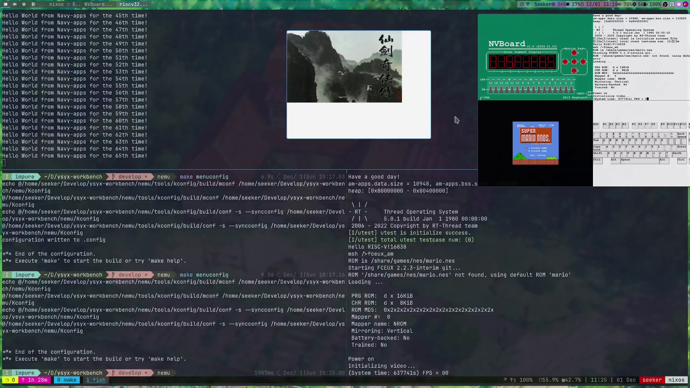

---

###### 概述

本次实验参考了南京大学 计算机科学与技术系 计算机系统基础 课程实验(NJU PA)和ysyx官方文档,从零开始实现了一个riscv架构的模拟器(支持vga,uart,serial,ps2keyboard)的模拟器(后文称nemu(NJU EMUlator)),使用chisel正确实现了riscv架构处理器核(后文称npc(New Processor Core))并且将其接入Soc(ysyxSoC),实现了一个软件层面的"抽象机"(后文称作Abstract Machine)使得基于抽象层开发的软件能被轻松移植到各种架构的机器上(native,riscv32e,riscv32,riscv64,mips,loongarch...),并且在抽象层之上实现了一个简单的操作系统(后文称作Nanos-lite),nanos-lite支持了异常\时钟中断\系统调用\虚拟内存\分时多任务,并且有一个简单的fs(文件系统)(后文称作sfs(Simple File System)),并且向nanos-lite上移植了标准库(Newlibc,libminiSDL,libfixedptc)等，并移植了pal,flappy-bird等游戏


---

### 何为操作系统?我们写操作系统需要实现什么?

(来自ChatGPT)操作系统（OS）是管理计算机硬件和软件资源的系统软件。它为用户和应用程序提供基本功能和服务，如文件管理、内存管理、进程管理、设备控制和用户界面。操作系统的主要目标是提高计算机系统的效率和可用性，使用户能够方便地执行各种任务。


---

### 狭义的操作系统：硬件和软件的中间层

服务于程序,管理硬件

- fs->管理硬件
- vm->管理内存
- INTR+shedule->管理资源分配
- libs->服务于软件


---

## 项目总体架构

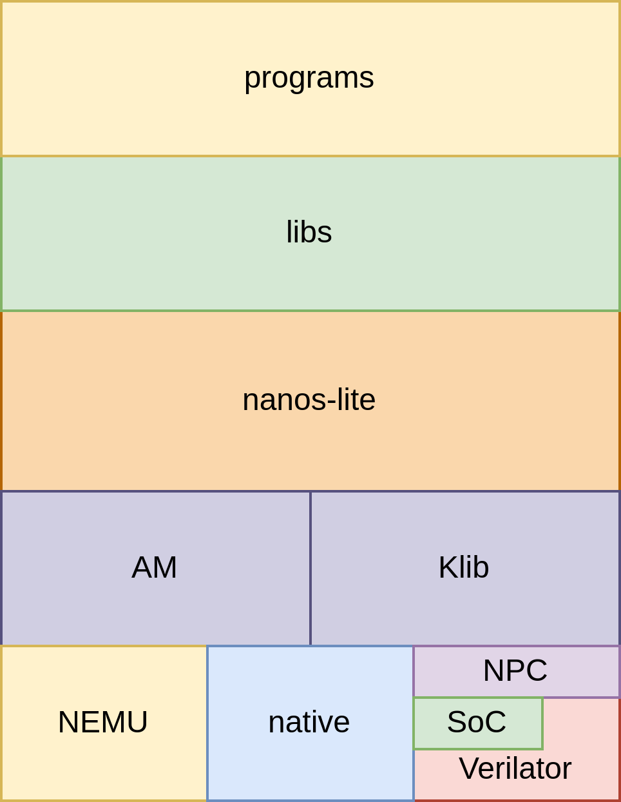

---

##### 详细设计&&编码设计:围绕以下几个问题展开

<!-- 本模块讲围绕下面几个方面展开 -->
- AM = TRM + IOE + CTE + VME + MPE
- 如何经行syscall/ecall?
- 如何判断ecall具体类型?
- 如何将给syscall传递参数/syscall的结果反回?
- 简易文件系统(sfs(Simple FileSystem))的实现
- 硬件中断如何实现?
- 简单的基于时间片轮转调度
- 栈切换的细节
- 虚拟内存和malloc如何实现(menu-riscv)
- 加载器(loader)的实现

---

##### AM = TRM + IOE + CTE + VME + MPE

**"程序在计算机上运行"的宏观视角: 计算机是个抽象层**

**"程序在计算机上运行"的微观视角: 计算机是个状态机**


---

##### AM = TRM + IOE + CTE + VME + MPE


- 基本环境抽象成TRM(Turing Machine) ,图灵机, 最简单的运行时环境, 为程序提供基本的计算能力
- 把上下文管理抽象成CTE(Context Extension)
- 输入输出扩展抽象成IOE(I/O Extension)
- 虚存扩展抽象成VME(Virtual Memory Extension)
- 多处理器扩展MPE(Multi-Processor Extension) - 没实现
- 上下文抽象成Context

```c
struct Context {
  uintptr_t gpr[NR_REGS], mcause, mstatus, mepc, mscratch;
  void *pdir;
};
```

---

##### AM = TRM + IOE + CTE + VME + MPE

```c
// ----------------------- TRM: Turing Machine -----------------------
extern   Area        heap;
void     putch       (char ch);
void     halt        (int code) __attribute__((__noreturn__));

// -------------------- IOE: Input/Output Devices --------------------
bool     ioe_init    (void);
void     ioe_read    (int reg, void *buf);
void     ioe_write   (int reg, void *buf);
#include "amdev.h"

// ---------- CTE: Interrupt Handling and Context Switching ----------
bool     cte_init    (Context *(*handler)(Event ev, Context *ctx));//用于进行CTE相关的初始化操作. 其中它还接受一个来自操作系统的事件处理回调函数的指针
//当发生事件时, CTE将会把事件和相关的上下文作为参数, 来调用这个回调函数, 交由操作系统进行后续处理.
void     yield       (void);//用于进行自陷操作, 会触发一个编号为EVENT_YIELD事件. 不同的ISA会使用不同的自陷指令来触发自陷操作
bool     ienabled    (void);
void     iset        (bool enable);
Context *kcontext    (Area kstack, void (*entry)(void *), void *arg);
//创建内核线程-kstack是栈的范围, entry是内核线程的入口, arg则是内核线程的参数. 要求内核线程不能从entry返回,

// ----------------------- VME: Virtual Memory -----------------------
bool     vme_init    (void *(*pgalloc)(int), void (*pgfree)(void *));
void     protect     (AddrSpace *as);
void     unprotect   (AddrSpace *as);
void     map         (AddrSpace *as, void *vaddr, void *paddr, int prot);
Context *ucontext    (AddrSpace *as, Area kstack, void *entry);

// ---------------------- MPE: Multi-Processing ----------------------
bool     mpe_init    (void (*entry)());
int      cpu_count   (void);
int      cpu_current (void);
int      atomic_xchg (int *addr, int newval);

```

---

#### AM-REGS

AM_TIMER_CONFIG,AM_INPUT_CONFIG,AM_TIMER_UPTIME,AM_GPU_FBDRAW
这些"抽象寄存器"实际上是一个存放了对应函数指针的跳转表,函数反回值是对应的寄存器的struct
其实使用gdb调试/clangd宏展开能很容易明白

<!-- 
 -->
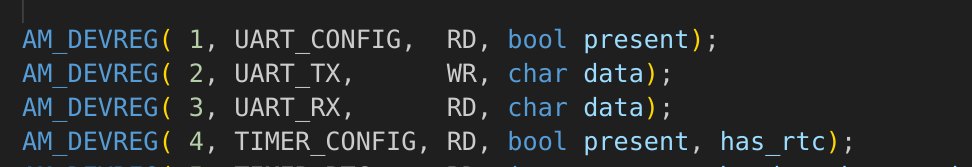
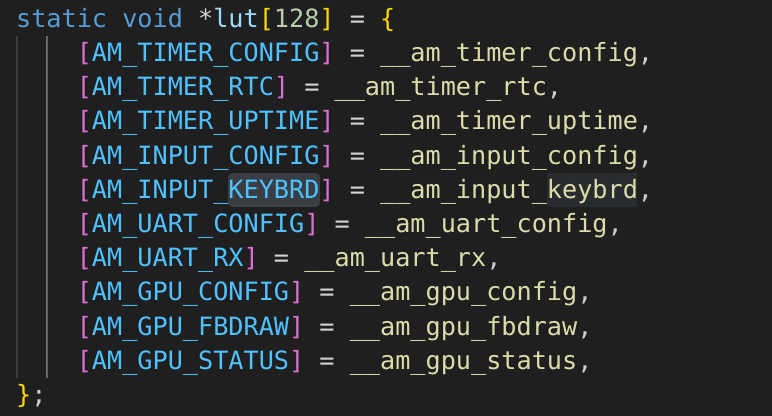

---

#### 如何使用工具来帮助理解AM与用户程序的交互

~~其实AM的设计并不是很复杂，直接RTFM+GPT就好了~~
当然运用合理的工具还是能够加速的
gdb
~~编译器宏展开~~clangd宏展开
ftrace

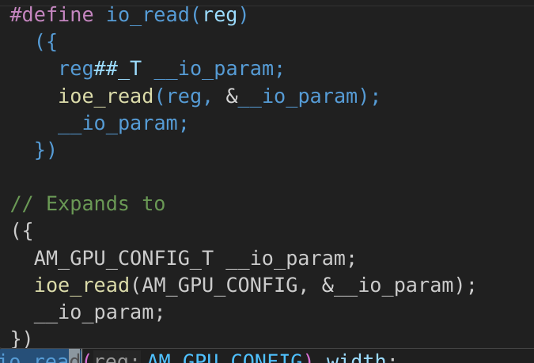
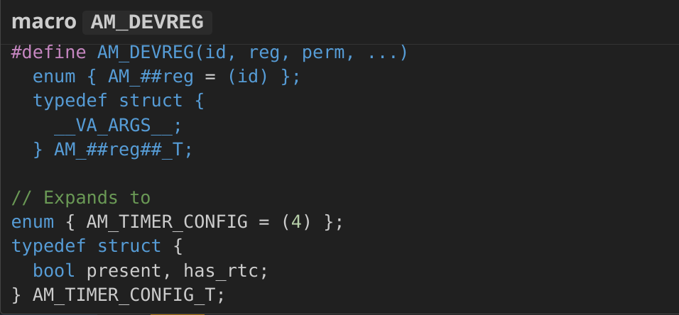
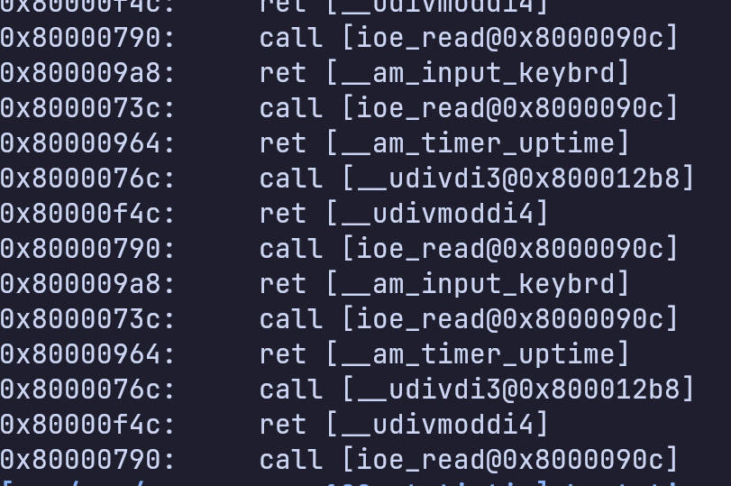

---


### 如何经行syscall/ecall?

首先,对于不同的ISA,异常的实现方式肯定不同,所以,应该对不同的ISA有不同的处理方式

具体到处理器应该如何执行,我们约定,在执行任意一条ecall的时候,必须先执行一次 cte_init (就如上文所述,在AM中,我们把上下文管理拓展抽象成了CTE),那么,在各个ISA就可以实现各自的设置了

```c
bool cte_init (Context *(*handler)(Event ev, Context *ctx)); 
//用于进行CTE相关的初始化操作. 其中它还接受一个来自操作系统的事件处理回调函数的指针
//当发生事件时, CTE将会把事件和相关的上下文作为参数, 来调用这个回调函数, 交由操作系统进行后续处理.

```


---

#### 对于riscv-软件部分

在riscv中,有一个专门的CSR寄存器叫做mtvec,参考riscv-instruction manual:`The mtvec register is an MXLEN-bit WARL read/write register that holds trap vector configuration,
consisting of a vector base address (BASE) and a vector mode (MODE).`

那么, am的实现就简单了,我们只要保存用户设置的回调函数,并且把我们自己写的汇编函数入口地址写入mtvec

**由于trap.S是实现虚拟内存实现的重要的一环,所以在虚拟内存部分我再详细介绍**


---

#### 对于riscv-软件部分

```c
bool cte_init(Context*(*handler)(Event, Context*)) {
  // initialize exception entry
  asm volatile("csrwr %0, 0xc" : : "r"(__am_asm_trap));  // 0xc = eentry

  // register event handler
  user_handler = handler;

  return true;
}

```

---

#### 对于riscv-硬件部分

比配到ecall指令后,直接把机器的pc设置成mtvec,并设置机器的状态(在后面详细介绍)

比配到ecall指令后,直接把机器的pc设置成mtvec,并设置机器的状态(在后面详细介绍)

```c
  INSTPAT("0000000 00000 00000 000 00000 11100 11", ecall  , N, s->dnpc=isa_raise_intr(0xb,s->pc));
```

---

#### nanos部分

调用syscall之前把参数放进约定的寄存器里就行了
**一些宏定义没有放上来，详见实验报告/源代码**

```c
# define ARGS_ARRAY ("syscall 0", "a7", "a0", "a1", "a2", "a0")
intptr_t _syscall_(intptr_t type, intptr_t a0, intptr_t a1, intptr_t a2) {
  register intptr_t _gpr1 asm (GPR1) = type;
  register intptr_t _gpr2 asm (GPR2) = a0;
  register intptr_t _gpr3 asm (GPR3) = a1;
  register intptr_t _gpr4 asm (GPR4) = a2;
  register intptr_t ret asm (GPRx);
  asm volatile (SYSCALL : "=r" (ret) : "r"(_gpr1), "r"(_gpr2), "r"(_gpr3), "r"(_gpr4));
  return ret;
}
int _open(const char *path, int flags, mode_t mode) {
  _syscall_(SYS_open, (intptr_t)path, flags, mode);
}
```

---

### 如何判断ecall具体类型?-riscv(这里是软件(AM)的部分)

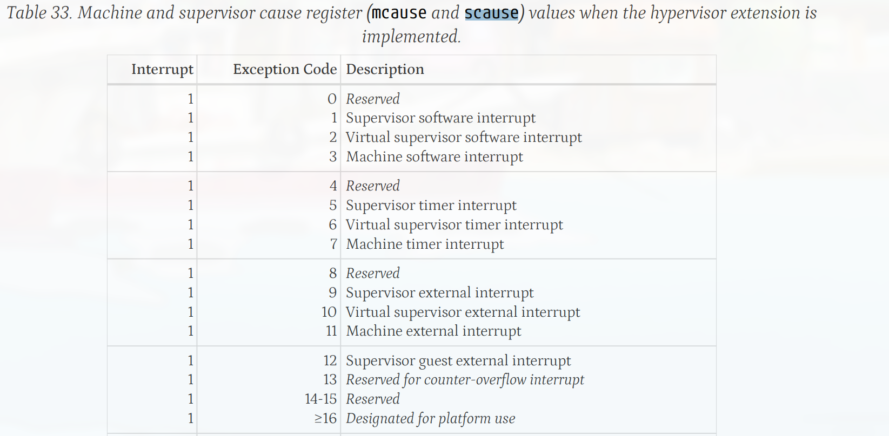

ecall以后跳转到`_am_asm_trap`->保存上下文->跳转`_am_irq_handle`->根据不同类型的原因选择处理方式->把应该恢复的上下文指针反回给`_am_asm_trap`->恢复上下文

---


### 如何将给syscall传递参数/syscall的结果反回?-riscv

riscv-ISA将a0作为返回值寄存器，讲a0-a7作为参数寄存器

那么，我们手动把这些参数放进这些寄存器就行了

---

### 简易文件系统(sfs(Simple FileSystem))的实现

文件系统,其实又是一个抽象层
文件的本质就是字节序列,而对设备的操作也是字节序列!所以,我们可以把设备也抽象成文件!

为了简化实现,我们约定:
- 每个文件的大小是固定的
- 写文件时不允许超过原有文件的大小
- 文件的数量是固定的, 不能创建新文件
- 没有目录

---

### 简易文件系统(sfs(Simple FileSystem))的实现

ramdisk中文件一个接着一个的存放，并且每次编译navy-apps的时候会更新ramdisk和包含了所有文件信息的头文件:

```
0
+-------------+---------+----------+-----------+--
|    file0    |  file1  |  ......  |   filen   |
+-------------+---------+----------+-----------+--
 \           / \       /            \         /
  +  size0  +   +size1+              + sizen +
```


---

### 简易文件系统(sfs(Simple FileSystem))的实现

```
typedef struct {
  char *name;
  size_t size;
  size_t disk_offset;
  ReadFn read;
  WriteFn write;
  size_t open_offset;
} Finfo;

{"/share/games/nes/mario.nes", 40976, 0},
{"/share/games/nes/README.md", 65, 40976},
{"/share/games/pal/wor16.fon", 77986, 41041},
{"/share/games/pal/midi.mkf", 762442, 119027},
```


---


那么实现就很简单了:
- 提够这几个api
- 如果是正常读取/写入，就正常，如果是对设备操作，就调用相应的函数

```c
Finfo file_table[] __attribute__((used)) = {
    [FD_STDIN] = {"stdin", 0, 0, invalid_read, invalid_write},
    [FD_STDOUT] = {"stdout", 0, 0, invalid_read, serial_write},
    [FD_STDERR] = {"stderr", 0, 0, invalid_read, serial_write},
    [FD_EVENTS] = {"/dev/events", 0, 0, events_read, invalid_write},
    [FD_FB] = {"/dev/fb", 0, 0, invalid_read, fb_write},
    [FD_DISPINFO] = {"/proc/dispinfo", 0, 0, dispinfo_read, invalid_write},

#include "files.h"
};
```


---

```c
//反回文件的index作为地址描述符，吧偏移量设置为0
int fs_open(const char *pathname, int flags, int mode); 
// 把数据读取到buf中，更新偏移量
size_t fs_read(int fd, void *buf, size_t len); 
//和read差不多
size_t fs_write(int fd, const void *buf, size_t len);
size_t fs_lseek(int fd, size_t offset, int whence);
int fs_close(int fd);

typedef size_t (*ReadFn)(void *buf, size_t offset, size_t len);
typedef size_t (*WriteFn)(const void *buf, size_t offset, size_t len);
```

---

### 硬件中断如何实现?

在真实cpu中，支持中断机制的设备控制器都有一个中断引脚, 这个引脚会和CPU的INTR引脚相连, 当设备需要发出中断请求的时候, 它只要将中断引脚置为高电平, 中断信号就会一直传到CPU的INTR引脚中.

由于简化实现,我只实现了时钟中断,所以就不需要实现一个很复杂的中断控制器了

在硬件(NEMU)过一段时间后便尝试把INTR拉高,NEMU每次执行完一条指令以后便查询INTR/有没有关中断,如果没有就触发中断,把控制权交给系统

---

### 简单的基于时间片轮转调度

既然实现了硬件中断,那么就可以很简单地实现基于时间片的轮转调度了

在之前我提到过,`cte_init`函数会接收一个参数，就是用户设置的回调函数(函数原型是`Context *(*handler)(Event, Context *)`,这个函数接收两个参数,一个是当前的事件,另一个是当前保存的上下文，反回需要调度的上下文)，利用这个回调函数就能实现进程调度了


---

### 简单的基于时间片轮转调度

nanos-lite的调度器维护着一个PCB的列表,PCB中存储以下信息:

- 内核栈
- 地址空间
- 最大的program_brk的数值
- 这个pcb是否有效


---

### 栈切换的细节

既然有栈切换，那么就要涉及到用户栈/内核栈之间的切换了。

为什么要实现内核栈呢->因为一个完备的操作系统不能相信用户ecall传递过来的信息，比如一个恶意程序可能可以:

```
la sp, kernel_addr
ecall
```

那么，kernel_addr所在的内存区域会被破坏!

所以,我们不能相信用户栈传递过来的信息!


---

### 栈切换的细节

在具体实现上,我使用了一个CSR寄存器(mstratch)来存储内核栈地址,并规定mstratch==0的时候就说明程序处于内核栈,如果mstratch！=0的时候就说明程序处于用户栈，此时mstratch存储的是内核栈的地址

保存上下文结束后，$pc的指针应该被存放在mepc里面,调用mret以后就会恢复上下文

---

### 栈切换的细节

这段汇编调试了很久,讲起来也很抽象,不过我分了5个stage
- 1 检测是否处于用户模式,如果处于用户模式，就切换到内核栈
- 2 保存上下文(保存在内核栈上)
- 3 设置mstatus
- 4 调用`__am_irq_handle`
- 5 恢复上下文
- 6 如果即将进入用户模式,就切换成用户栈
- 7 调用mret


---


### 虚拟内存和malloc如何实现(menu-riscv)

虚拟内存的实现涉及到软硬件结合,根据riscv手册,page-table walk应该由硬件实现,page-table 的管理可以在软件实现

再次翻阅riscv的手册,按照SV32实现

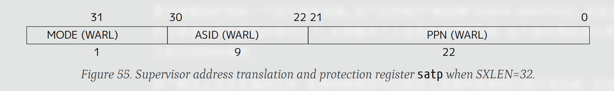
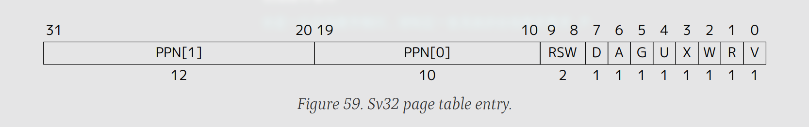

---

### 虚拟内存和malloc如何实现(menu-riscv)

因为一个页面大小是4kb,所以只需要22位就能记录一级页表的地址了

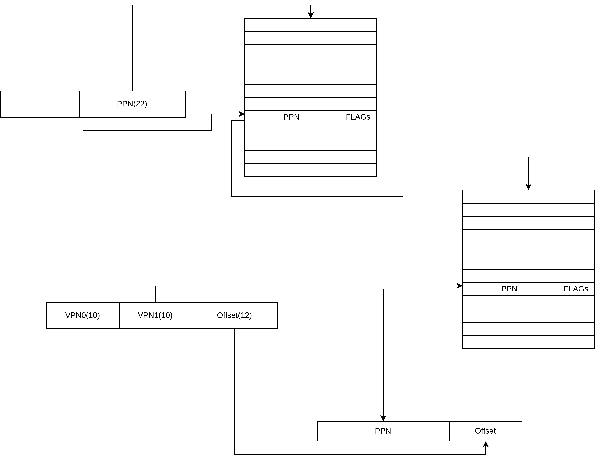


---

### 虚拟内存和malloc如何实现(menu-riscv)

现在需要决定什么东西应该放在应用层实现,什么东西应该放在软件层实现
- 硬件
  - 当检测到开启虚拟内存转换的时候,执行page-table-walk,把物理地址转换为虚拟地址

---

### 虚拟内存和malloc如何实现(menu-riscv)

- 软件
  - 在最开始是关闭虚拟内存转换的,在nanos-lite启动过程中调用`vme_init`初始化虚拟内存
    - 在`vme_init`中,先保存参数(`pgalloc_f`,`pgfree_f`)
    - 分配一级页表
    - 原地映射所有内存(保证系统内核代码正常运行和设备正常访问)
    - 设置statp(开启虚拟内存)

---

### 虚拟内存和malloc如何实现(menu-riscv)

- 软件
  - 在loader(加载用户程序的时候)
    - 调用`protect()`函数,这个函数会创建一个默认的地址空间
    - 调用`map()`映射内存
    - 加载程序
  - 在进程切换的时候切换地址空间


---

### 虚拟内存和malloc如何实现(menu-riscv)

回想之前提到的抽象层,现在解释一下各个函数的作用

```c
// ----------------------- VME: Virtual Memory -----------------------
bool     vme_init    (void *(*pgalloc)(int), void (*pgfree)(void *));
void     protect     (AddrSpace *as);
void     unprotect   (AddrSpace *as);
void     map         (AddrSpace *as, void *vaddr, void *paddr, int prot);
Context *ucontext    (AddrSpace *as, Area kstack, void *entry);
```

- `vme_init`两个来自操作系统的页面分配回调函数的指针, 让AM在必要的时候通过这两个回调函数来申请/释放一页物理页.
  - pgalloc_f 分配虚拟页面
  - pgfree_f 释放虚拟页面(没实现)

---
### 虚拟内存和malloc如何实现(menu-riscv)

```c
// ----------------------- VME: Virtual Memory -----------------------
bool     vme_init    (void *(*pgalloc)(int), void (*pgfree)(void *));
void     protect     (AddrSpace *as);
void     unprotect   (AddrSpace *as);
void     map         (AddrSpace *as, void *vaddr, void *paddr, int prot);
Context *ucontext    (AddrSpace *as, Area kstack, void *entry);
```


- `protect`创建一个默认的地址空间(复制nanos-lite的内核映射),这样就能访问设备的地址空间了
  - as地址空间
- `unprotect`销毁指定的地址空间(没实现)

---


```c
// ----------------------- VME: Virtual Memory -----------------------
bool     vme_init    (void *(*pgalloc)(int), void (*pgfree)(void *));
void     protect     (AddrSpace *as);
void     unprotect   (AddrSpace *as);
void     map         (AddrSpace *as, void *vaddr, void *paddr, int prot);
Context *ucontext    (AddrSpace *as, Area kstack, void *entry);
```

- `map`将地址空间as中虚拟地址va所在的虚拟页, 以prot的权限映射到pa所在的物理页
  - as 地址空间
  - va 虚拟地址
  - pa 物理地址
  - prot 保护模式

---

### 虚拟内存和malloc如何实现(menu-riscv)

```c
// ----------------------- VME: Virtual Memory -----------------------
bool     vme_init    (void *(*pgalloc)(int), void (*pgfree)(void *));
void     protect     (AddrSpace *as);
void     unprotect   (AddrSpace *as);
void     map         (AddrSpace *as, void *vaddr, void *paddr, int prot);
Context *ucontext    (AddrSpace *as, Area kstack, void *entry);
```

- `ucontext`创建用户进程
  - 参数as用于限制用户进程可以访问的内存,Ignore
  - kstack是内核栈,用于分配上下文结构,
  - entry则是用户进程的入口.


---

### 加载器(loader)的实现

程序存储在ramdisk中,我们肯定得把程序加载进指定的位置来执行,既然已经实现了虚拟内存,那么就很简单了

主要由两个函数组成，`loader`和`context_uload`组成
- `context_uload`
  - 初始化用户栈(使用new_page分配)
  - map内核栈
  - 调用ucontext
  - 复制argv,envp到用户栈

---

### 加载器(loader)的实现


- `loader`
  - 读取elf文件(按照segment)
  - 使用new_page(分配内存)
  - 把elf文件复制进内存
  - 清空bss段
  - 反回程序的起始地址

---

## 所以,演示视频演示了个啥?

什么，你还没看视频?->

【一生一芯-b线+NJU PA 完结纪念-从零开始创造属于你的计算机系统！】 https://www.bilibili.com/video/BV1GozdYSEgx/?share_source=copy_web


---

### 简单解释一下整个系统的运行流程

- 首先,nemu(硬件)初始化,从0x80000000开始执行指令(nanos-lite的)
  - 初始化sp指针,跳转到nanos-lite的main函数
  - nanos-lite打印logo和欢迎信息
  - nanos-lite初始化内存,外设,ramdisk,中断,文件系统
  - nanos-lite加载用户程序(hello,和menu(就是那个菜单))
  - nanos-lite触发自陷操作(ecall),把控制交给用户程序(menu)

---

    - menu的加载程序初始化栈指针和参数,调用main函数
    - memu初始化SDL库
      - 在初始化的过程中,SDL会获取当前时间(一次syscall)
        - 上下文切换到内核栈,识别出`EVENT_SYSCALL`,`SYS_time`,
        - 读取`AM_TIMER_UPTIME`抽象寄存器
        - AM访问`0xa0000048`(我定义的时钟地址)获取时间
        - NEMU(硬件)检测到读取的地址为`0xa0000048`,反回当前时间
        - nanos-lite拿到当前时间,把时间放在寄存器里面,将控制权交还给用户进程
      - 在初始化的过程中,SDL会获取当前屏幕大小(读取`/proc/dispinfo`文件)
      - 在读取文件的过程中会触发yield自陷,用来模拟设备访问缓慢的情况
    - 读取字符,BMP
    - 调用SDL库创建画布并写入界面
    - 调用`SDL_UpdateRect`更新显示(通过写入`/dev/fb`文件)
      - sfs会将数据写入AM的抽象寄存器,由AM对应的函数写入指定内存区域(MEM-Mapped IO)
    - 等待按键事件到来(读取`/dev/events`文件)
      - sfs读取AM抽象寄存器
      - AM抽象寄存器对应的函数会读取按键事件并反回
      - NEMU的细节就不讲了,但按键事件到来,NEMU会先把按键事件存储到一个按键环形缓冲区中,然后等待读取
    - 过程中会有时钟中断随机到来,会切换到hello程序输出内容
    - 如果按键到来,execve对应的程序
      - menu调用execve(syscall)
        - 切换到内核栈
        - 匹配到系统调用类型execve,检查文件存在
        - 调用加载器把程序加载到内存(使用当前pcb,用户栈重新分配)
        - 当前pcb切换到boot_pcb
        - 自陷

---

## 总结

- "程序在计算机上运行"的宏观视角: 计算机是个抽象层
- "程序在计算机上运行"的微观视角: 计算机是个状态机

